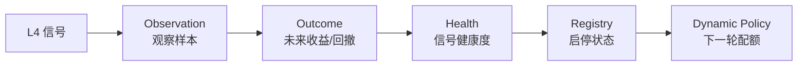

# 金融术语与策略概念速查手册

本文档汇总了 Wyckoff-Analysis 项目中涉及的所有金融术语、量化指标和策略概念，帮助新同学快速理解系统逻辑。

---

## 1. 回测指标

| 名词 | 英文 | 含义 |
|------|------|------|
| **胜率** | Win Rate | 所有交易中盈利笔数占比。如 35.7% 表示 100 笔交易里约 36 笔赚钱 |
| **平均收益** | Average Return | 每笔交易的平均盈亏百分比。-0.65% 表示平均每笔亏 0.65% |
| **中位收益** | Median Return | 所有交易收益排序后的中间值。比平均值更抗极端值干扰，能反映"典型一笔"的表现 |
| **最大回撤** | Max Drawdown | 从净值最高点到最低点的最大跌幅。衡量策略中途"最痛苦"的时刻 |
| **夏普比率** | Sharpe Ratio | **(收益率 - 无风险利率) / 收益率波动率**。衡量每承担一单位风险能获得多少超额回报。> 1 优秀，0~1 一般，< 0 表示亏损 |
| **VaR95** | Value at Risk (95%) | 在 95% 置信水平下，单笔交易可能发生的最大损失。给出"平时最坏会坏到哪"的快速下界 |
| **CVaR95** | Conditional VaR (95%) | 当亏损击穿 VaR 阈值后，那些最糟糕情况下的平均损失幅度。是对黑天鹅尾部风险的终极度量 |
| **最长连亏** | Max Consecutive Losses | 连续亏损的最大笔数。用于评估实盘心理压力和资金使用节奏 |
| **持有天数** | Hold Days | 买入后固定持有的交易日数，到期无条件卖出。项目里常测 5/6/7/8/10/15 天 |
| **止损线** | Stop Loss | 持有期间如果亏损达到该阈值（如 -7%），立即卖出止损，不再等到期 |
| **止盈线** | Take Profit | 持有期间如果盈利达到该阈值，立即卖出锁定利润。设为 0 表示不止盈 |

---

## 2. Wyckoff 方法论

**Wyckoff（威科夫）** 是 1930 年代华尔街传奇交易员 Richard Wyckoff 提出的量价分析框架，核心思想：**跟踪主力资金（Composite Man / 庄家）的行为**。

### 市场四阶段

| 阶段 | 含义 |
|------|------|
| **吸筹 (Accumulation)** | 主力在低位悄悄买入，成交量温和放大但股价不涨。散户看到"横盘无聊"选择离场，主力正在收集筹码 |
| **上涨 (Markup)** | 吸筹完成后，主力推动股价上升。特征是均线多头排列、成交量健康放大 |
| **派发 (Distribution)** | 主力在高位悄悄卖出，股价看似还在创新高但量能衰减。散户看到"还在涨"跟风追入，主力正在出货 |
| **下跌 (Markdown)** | 派发完成后，股价自由落体。筹码已从主力手中转移到散户手中 |

### 核心触发信号（本项目 L4 层检测目标）

| 信号 | 含义 |
|------|------|
| **Spring（弹簧效应）** | 吸筹末期，股价突然跌破支撑位引发恐慌卖盘，随即快速拉回。正式检测优先使用近期 swing low 中位数作为抗噪支撑，摆动点不足时回退窗口最低收盘价 |
| **SOS (Sign of Strength)** | 放量突破，确认吸筹结束、上涨开始的信号。需要伴随成交量大幅放大（>= 2 倍）和显著涨幅（>= 4.5%） |
| **LPS (Last Point of Support)** | 缩量回踩。SOS 突破后的第一次回调，成交量极度萎缩（不足前期一半），说明市场已无抛压，是低风险上车点 |
| **EVR (Effort vs Result)** | 放量抗跌。成交量巨幅放大（巨大 Effort），但股价没有相应大跌（Result 不差），意味着主力在底部大量承接 |
| **Compression（压缩蓄势）** | 连续多日 ATR 收窄 + 成交量萎缩，表明供应枯竭、多空平衡即将被打破。对应 Wyckoff Phase B→C 的能量压缩状态，常出现在 Spring/SOS 之前 |
| **UTAD (Upthrust After Distribution)** | 派发末期，股价放量突破近期阻力后迅速收回并留下长上影。系统以 `upthrust_warning` 作为 L5 风险信号阻断新候选 |
| **Creek/LPS confirmation** | 用前序 swing high 构造可外推的 Creek 阻力线；只有先越过 Creek、随后缩量回踩仍守在线上，才把 LPS 视为结构确认。当前仅在 D/E 消融组启用 |
| **Strategy ablation A-E** | 同一数据与执行参数下的规则消融：A 基线，B=UTAD，C=regime 阈值，D=Creek/LPS+时序，E=全部组合；用于区分单项贡献和组合交互 |
| **Treatment exposure** | 消融组相对 A 组实际改变的 `(signal_date, code)` 交易集合；零暴露表示规则没有进入最终候选，不能据此评价收益贡献 |
| **SOW (Sign of Weakness)** | 放量下跌，确认派发结束、下跌开始的信号 |

---

## 3. 漏斗管线 (Funnel Pipeline)

项目的选股流程像漏斗一样层层过滤，从全市场 5000+ 只股票中筛选出少数高确定性标的：

| 层 | 名称 | 做什么 | 典型淘汰率 |
|----|------|--------|-----------|
| **L1** | 基础过滤 | 剔除 ST 股、停牌股、次新股、微盘股（市值 < 35亿）、流动性不足（日均成交 < 5000 万） | ~60% |
| **L2** | 八通道强度 | 主升、潜伏、吸筹、地量、暗中护盘、趋势延续、加速突破、点火破局分别评估，只保留结构上有资金行为的股票 | ~80% |
| **主线引擎** | Mainline Engine | L1 后并联的主题候选源，基于概念热度、概念映射、主题雷达、财务质量和量价 timing 发现 A 股主线票 | 取 TopN |
| **候选车道** | Candidate Lane | L1 通过但传统 L2/L4 尚未完全成形的趋势回踩、强承接、平台突破观察样本 | 观察池 |
| **L3** | 板块/概念共振 | 使用行业和概念强度过滤噪音，同时允许强个股和主线主题绕过固定 Top-N 行业限制 | ~50% |
| **L4** | Wyckoff 触发 | 检测 Spring / SOS / LPS / EVR / Compression / Trend Pullback 等量价信号 | ~90% |
| **Structure Shadow** | 动态区间观察对照 | 在 L3 候选上比较正式 L4 与动态交易区间的 Spring/LPS/SOS/EVR 命中；区间质量使用测试次数、ATR 归一化宽度和漂移，只写诊断 metrics，不进入正式候选或 BUY |
| **L5** | 退出信号 | 持有期间监控是否出现派发信号（SOW / UTAD），决定是否提前退出 | — |
| **评分排名** | watch_score | 对通过 L4 的候选股综合打分排序，选 TopN 输出给 AI 研报 | 取 Top3~15 |

### L2 八通道详解

| 通道 | 英文 | 寻找什么样的股票 |
|------|------|----------------|
| **主升浪** | Markup | 均线多头排列（MA50 > MA200），RPS 动量达标；年线乖离上限已放宽（动量通道约 55%，趋势 L4 约 60%），鱼尾仍拦截 |
| **点火破局** | SOS Bypass | 单日放量突破，要求 RPS120 达到底线，用来捕捉低位突然点火但过滤纯消息异动 |
| **潜伏** | Ambush | 长期强（RPS120 高）但短期弱（RPS50 低），回调到年线附近，专做主升后的首次回踩 |
| **吸筹** | Accumulation | 接近年内低点，振幅收窄，均线胶着，量能萎缩——典型的主力默默收集筹码形态 |
| **地量蓄势** | Dry Volume | 近期出现极端缩量（量能降至 60 日的 5% 分位），说明卖压已被完全消化 |
| **暗中护盘** | RS Divergence | 大盘暴跌时该股拒绝创新低且缩量，说明有主力在暗中托底 |
| **趋势延续** | Trend Continuation | 已经进入强趋势且回撤受控的主线股，避免被年线乖离阈值误杀 |
| **加速突破** | Breakout Acceleration | 站上 MA50 后短期 RPS、涨幅和量能同步爆发，捕捉题材从底部刚扩散的阶段 |

### 主线引擎术语

| 名词 | 含义 |
|------|------|
| **Mainline Engine** | L1 后并联的主线发现模块，解决传统 L2 确认太慢、错过 A 股主线扩散的问题 |
| **主线回踩 MA5/MA10/MA20** | 主升段优先认短均线回踩，再认 MA20；不再只等年线附近 |
| **主线趋势书** | 实盘主仓：主题连续 + 高 RPS + 确认买点 |
| **结构观察书** | Spring/LPS/Compression 等轻仓或观察，默认 5 日兑现 |
| **mainline_active** | NEUTRAL 交易模式：允许主题晋级与正式推荐，旁路仍关 |
| **执行纪律卡** | 报告顶部固定文案（`execution_playbook`）：闸门/主线优先/时间管理/灾难地板 |
| **时间管理** | 非主线约 5 日时间止盈；主线约 15 日 + 破 MA20 再减 |
| **灾难止损地板** | 新开仓约 -12%，防黑天鹅，**不是**日常洗盘止损 |
| **theme_score** | 概念热度、连续性和主题雷达强度得分 |
| **stock_role_score** | 股票在主题内的核心程度、相对强度和趋势位置得分 |
| **quality_score** | 财务质量软评分，优先使用 TickFlow 可取到的 ROE、负债率、营收和利润趋势等字段 |
| **timing_score** | 买点时机评分，检查 MA20/MA50、回踩不破、平台突破、缩量承接等 |
| **主线买点候选** | 主线分、个股角色、质量和 timing 都过关，可进入 AI 复核；是否可买仍由市场总闸和尾盘确认决定 |
| **主线观察** | 主题和个股不错，但 timing 尚未满足，只跟踪不买 |
| **过热不追** | 主题很强但短线离均线太远、放量长上影或冲高回落，禁止追高 |

---

## 4. 板块轮动

### 基本概念

| 名词 | 含义 |
|------|------|
| **申万一级行业** | 申银万国证券制定的行业分类标准，把 A 股分成 31 个一级行业（银行、电子、医药生物、食品饮料等），是 A 股最常用的行业分类体系 |
| **板块轮动** | 资金在不同行业间快速切换的现象。今天资金涌入新能源，明天转向银行，后天又去了半导体 |
| **板块一日游** | A 股特有的极端轮动现象——某个行业今天涨停潮，明天就哑火，换下一个行业表演。实测数据显示 Top3 板块次日重合率仅 14.8%，即 85% 的概率"今天的热门明天就不热了" |

### 板块轮动状态分类

系统根据当日各行业涨跌分布，将市场板块状态归类为 5 种：

| 状态 | 英文 | 含义 | 评分加减分 |
|------|------|------|-----------|
| **共识高潮** | CONSENSUS_CLIMAX | 多个板块同时暴涨，市场亢奋见顶。数据显示 3 日后跌 > 2% 的概率 29.8% | **-0.08**（惩罚追高） |
| **分歧回调** | DISAGREEMENT_PULLBACK | 板块涨跌严重分化，领涨板块开始回调。看似"低吸机会"但实测 3 日胜率仅 50% | **+0.01**（几乎中性） |
| **健康主线** | HEALTHY_MAINLINE | 有一条明确的主线板块持续领涨，其余板块温和跟随。市场最健康的赚钱效应状态 | **+0.03**（鼓励跟随） |
| **派发风险** | DISTRIBUTION_RISK | 领涨板块出现高位放量滞涨特征，主力可能正在派发 | **-0.10**（最大惩罚） |
| **中性混沌** | NEUTRAL_MIXED | 没有明显板块主线，各行业涨跌互现，无序状态 | **0.00**（不加不减） |

---

## 5. 大盘水温 (Market Regime)

通过上证指数的技术指标（MA50/MA200 交叉、均线斜率、单边涨跌幅、市场广度等）判断当前市场整体状态，用于控制仓位大小：

| 状态 | 英文 | 含义 | 新开仓策略 |
|------|------|------|---------|
| **中性** | NEUTRAL | 正常市况，主战场 | **主线/趋势主导**（配额约 5+1） |
| **过热** | RISK_ON | 短线过热，追新负期望 | **0% 禁止新仓**（只管理旧仓） |
| **恐慌修复候选** | PANIC_REPAIR | 恐慌日后出现价格反弹且当日广度明显修复，但尚未经过次日验证 | **仅观察/修复复核，禁止新仓** |
| **恐慌修复成立** | PANIC_REPAIR_CONFIRMED | 修复候选次日同时通过指数价格与全市场广度确认 | **小额试探准备 (PROBE_READY)，仓位上限5%** |
| **盘中恐慌修复** | PANIC_REPAIR_INTRADAY | 盘中满足暴跌日后强烈反弹且成交量/广度快速回升 | **小额试探准备 (PROBE_READY)，仓位上限5%** |
| **转弱** | RISK_OFF | 均线空头，下行确认 | **禁止新仓** |
| **结构周期** | BULL / TRANSITION / BEAR | 由指数相对 MA50/MA200 与 MA50 斜率定义的中期方向，独立于近 3 日反弹；BEAR 默认映射为 RISK_OFF | **结构熊市禁止普通新仓** |
| **崩盘** | CRASH | 暴跌/广度断崖 | **自动启用抗跌观察车道 (crash_resilience_watch)，只观察禁止新仓** |
| **崩盘左侧试探** | CRASH_LEFT_PROBE | 左侧观察池候选盘中跌破支撑后收回，收位与承接达标 | **LEFT_PROBE_READY；Top1、单票2%，禁止 ATTACK** |

### 实测验证

| 水温 | 2025-10 ~ 2026-04 平均收益 | 结论 |
|------|--------------------------|------|
| NEUTRAL | **+1.17%** | 唯一正收益的市场状态 → 主战场 |
| RISK_ON | **-1.54%** | 过热追高亏钱 → **正式禁止新开仓** |
| CRASH | **-3.2%** | 崩盘日普遍开仓负期望；只保留严格黄金坑 Top1 小仓试错 |

水温仓控的核心逻辑：**只在 NEUTRAL 做主线确认；RISK_ON 不追新，比“半仓硬做”更重要**。

---

## 6. watch_score 评分公式

传统 Wyckoff 候选通过 L4 后按以下公式综合评分。主线候选使用 `mainline_score`，再和候选车道统一合并排序：

```
watch_score = 0.25 × q20 + 0.20 × q5 + 0.05 × q3
            + 0.20 × dry_q + 0.30 × trigger_q
            + hot_bonus + sector_bonus
```

| 因子 | 含义 | 权重 | 说明 |
|------|------|------|------|
| **q20** | 20 日涨幅在全市场的百分位排名（0~1） | 25% | 中期动量，筛选趋势向上的股票 |
| **q5** | 5 日涨幅排名 | 20% | 短期动量，确认近期在加速 |
| **q3** | 3 日涨幅排名 | 5% | 超短期动量，适应 A 股快速轮动特性 |
| **dry_q** | "缩量程度"排名（量越缩排名越高） | 20% | 缩量说明洗盘充分、卖压枯竭 |
| **trigger_q** | Wyckoff 信号强度排名 | **30%** | **最高权重**，信号质量是选股第一要素 |
| **hot_bonus** | 处于当日热门板块的额外加分 | +0.02 | 板块风口的顺势加成 |
| **sector_bonus** | 板块轮动状态的加/减分 | -0.10 ~ +0.03 | 见上方板块轮动状态表 |

**设计哲学**：传统候选仍以 trigger_q 为核心，主线候选则以主题强度、个股角色、财务质量和 timing 确认为核心。两条路径最终都必须服从大盘水温和尾盘二次确认。

---

## 7. 相对强弱指标

| 名词 | 英文 | 含义 |
|------|------|------|
| **RPS** | Relative Price Strength | 欧奈尔 CANSLIM 法则核心指标。一只股票在一段时间内的涨幅超越全市场所有股票的百分位（0~100）。RPS50=90 说明近 50 天收益率秒杀全场 90% 的股票 |
| **RS** | Relative Strength | 个股涨跌幅减去同期大盘涨跌幅，衡量股票相对大盘是领涨还是跟跌 |
| **MA** | Moving Average | 移动平均线。MA50 为 50 日均线，MA200 为 200 日均线（年线）。MA50 > MA200 为**多头排列**（趋势向上） |
| **ATR** | Average True Range | 平均真实波动率。不同股票波动率不同（银行股日均 1%，妖股日均 8%），ATR 用于设定自适应止损线 |
| **乖离率** | Bias | 股价距离长期均线（如 MA200）的百分比距离。偏离过大说明被过度炒作，面临均值回归风险 |

---

## 8. 回测偏差

在理解回测结果时，必须意识到以下两种系统性偏差：

| 偏差 | 英文 | 含义 |
|------|------|------|
| **前视偏差** | Look-ahead Bias | 在历史回测中如果不小心用到了"当时那一刻尚未发生的数据"（比如用今天的市值去过滤 2024 年的股票），就叫"偷看答案"。回测结果会虚高 |
| **幸存者偏差** | Survivorship Bias | 股票池只包含当前仍在上市的公司，那些已退市的"暴雷股"不在回测样本中，会高估策略的安全性 |
| **滚动前推验证** | Walk-forward Validation | 在较早训练窗口选择参数，再把同一参数原样放到后续窗口测试；测试窗口不能重新选参 |

**因此**：本项目的回测用于"参数方向验证"是有效的，用于"实盘绝对收益承诺"是不充分的。

---

## 9. OMS 风控相关

| 名词 | 英文 | 含义 |
|------|------|------|
| **OMS** | Order Management System | 订单管理系统。AI 建议不直接下单，执行权在 OMS 的风控引擎手中 |
| **SLTP** | Stop Loss & Take Profit | 止损与止盈的组合退出机制 |
| **NAV** | Net Asset Value | 账户净资产价值。OMS 根据 NAV 分配单次交易预算 |
| **盈亏比** | Risk/Reward Ratio | 预期收益与预期风险的比值。如止损 -7% / 止盈 +18% 的盈亏比为 2.57:1 |
| **熔断** | Circuit Breaker | 当市场进入 CRASH 或盘前检测到极端风险（RISK_OFF / BLACK_SWAN）时，OMS 直接冻结买入权限 |
| **Springboard ABC** | 右侧信号三项确认 | 对 SOS / EVR 和趋势候选的成交量、价格与支撑确认。普通弱确认至少 2/3，纯 SOS 正式候选要求 3/3 |
| **观察买入** | Watch Buy | 有买入逻辑但当前不可直接下单。包括未完成二次确认、高位动量或当日已触及/收于涨停的候选 |
| **ATR 止损放宽** | ATR Stop Relaxation | 持仓尾盘诊断中，根据波动率在上限内降低固定止损线，避免正常洗盘误杀；它只放宽、不收紧，也不取消硬止损 |

---

## 10. 技术/数据源相关

| 名词 | 含义 |
|------|------|
| **tushare** | 国内主流金融数据接口，提供 A 股日线行情、财务数据、指数数据等。有频率限制（500 次/分钟）和 IP 限制（最多 2 个） |
| **申万指数 (SW Index)** | 由申万宏源编制的行业指数，tushare 中通过 `sw_daily` 接口获取（注意不是 `index_daily`） |
| **快照 (Snapshot)** | 将一次性拉取的全量股票数据序列化到本地文件（csv.gz），后续回测直接读快照而非再次请求网络，提升速度并避免 API 限制 |
| **前复权 (qfq)** | 以最新价格为基准向前调整历史价格，消除分红送股导致的价格跳空。回测默认使用前复权数据 |

## 11. 信号反馈闭环



| 名词 | 含义 |
|------|------|
| **Observation** | 某日某股票触发某个 L4 信号的原始样本，落在 `signal_observations`。 |
| **Outcome** | Observation 之后 1/3/5/10/20 日的收益和最大回撤，落在 `signal_outcomes`。 |
| **Health** | 按信号类型聚合后的胜率、均值收益、样本数和权重，落在 `signal_health_daily`。 |
| **Registry** | 信号生命周期表，控制信号是 `ACTIVE`、`WATCH`、`EXPERIMENTAL` 还是 `RETIRED`。 |
| **Shadow Run** | 动态策略旁路演练：真实推荐不变，只记录动态策略会新增或移除哪些候选。 |
| **Dynamic Policy** | 根据信号健康度、registry 和市场广度，动态调整 Trend / Accum 候选配额。 |

---

## 12. 盘中分析指标 (IntradayProfile)

系统通过 1m/5m/15m 分钟线，在盘中对标的做实时结构化评估。日线负责"买什么"，分钟线负责"这一刻该不该动手"。

### 位置类（此刻价格在哪）

| 名词 | 英文 | 含义 |
|------|------|------|
| **VWAP** | Volume Weighted Average Price | 成交量加权平均价。代表今天所有参与者的平均持仓成本。价格在 VWAP 上方 = 今天的买方整体盈利、主力不急出；在下方 = 买方被套，存在抛压 |
| **VWAP 偏离** | vwap_pos | 当前价相对 VWAP 的偏离百分比。正值 = 在 VWAP 上方，负值 = 下方 |
| **日内位置** | close_pos | 当前价在今天最高-最低之间的位置（0=日低, 1=日高）。收盘靠近日高 = 买方控局；靠近日低 = 卖方压制 |

### 方向类（往哪走、走多快）

| 名词 | 英文 | 含义 |
|------|------|------|
| **短周期趋势** | trend_short | 5m 级别的价格方向（up/flat/down）。用最近 8 根 5m bar 收盘价的线性回归斜率判断 |
| **中周期趋势** | trend_mid | 15m 级别的价格方向。同上逻辑，窗口更长 |
| **30 分钟动量** | momentum_30m | 最近 30 分钟的价格涨跌幅%。衡量瞬时力量 |
| **15 分钟动量** | momentum_15m | 最近 15 分钟的价格涨跌幅%。更短窗口，对尾盘突变敏感 |

> **趋势 vs 动量**：趋势看"一段时间整体方向"（平滑），动量看"最近这一截涨跌幅"（尖锐）。趋势向上 + 动量为负 = 正常回踩；趋势向下 + 动量为正 = 反弹但未转势。

### 成交行为类（钱往哪流）

| 名词 | 英文 | 含义 |
|------|------|------|
| **量能分布** | volume_concentration | 今天的成交量堆积在高位还是低位。`high` = 大部分成交发生在价格上半区（买方愿意追高），`low` = 成交堆在低位（高位无人接盘） |

### 威科夫验证类

| 名词 | 英文 | 含义 |
|------|------|------|
| **Spring 质量** | spring_quality | 日线检测到 Spring（跌破支撑后收回）时，分钟线验证收回速度。5 分钟内收回 = 90 分（假跌破/主力洗盘）；30 分钟才爬回 = 30 分（可能真跌破） |

### 综合评分

| 名词 | 英文 | 含义 |
|------|------|------|
| **盘中强度** | strength_score | 将上述所有特征加权汇总为 0-100 分。VWAP 位置权重最高（±12），其次是日内位置（±10）和动量（±8）。基准分 50，>70 偏强，<30 偏弱 |

## 13. 研究假设（Research Hypothesis）

对策略规则为什么可能有效、适用范围、信号定义和失效条件的可追踪声明。通过
`research_hypothesis` 关联回测、归因和 shadow 证据；`validated` 表示研究证据通过，
不等于自动获得正式交易权限。研究状态只能通过受控 `transition` 改变；从 `testing` 晋级
`validated` 必须同时具备跨周期回测和参数稳定性通过证据。

**参数孤岛（Parameter Island）**：只有某一个精确参数组合表现好，而相邻的持有期、止损、止盈或
移动止盈组合明显失效。系统要求稳健锚点附近至少覆盖两个单参数邻居，并让至少一半邻居同样跨周期
为正，避免把偶然拟合当成稳定策略。
