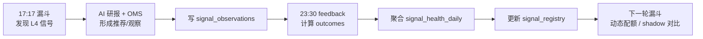

# 策略手册

本文档描述 WyckoffAgent 的策略框架与执行流程。

设计理念：**主线趋势优先 + 量价确认 + 结构化风控 + 人机协同**。
系统先用全市场数据发现 A 股主线与候选，再用确认与尾盘过滤买点，最后交给 AI 复核和 OMS。

**实盘怎么用（先读）**：[docs/OPERATOR_PLAYBOOK.md](docs/OPERATOR_PLAYBOOK.md)

- 日漏斗 = 候选与环境；尾盘 = 今天能不能买（串联，非二选一）
- 只买：环境允许 × 主线优先 × confirmed × 尾盘 BUY；唯一例外是满足黄金坑硬条件的 `CRASH_LEFT_PROBE`

覆盖模块：
- Step2 漏斗选股：`workflows/wyckoff_funnel.py` + `core/wyckoff_engine.py` + `core/mainline_engine.py`
- Step3 AI 研报：`workflows/step3_batch_report.py`（三阵营审判）
- Step4 持仓决断：`workflows/step4_rebalancer.py`（OMS 工单）
- 尾盘确认：`scripts/tail_buy_intraday_job.py` + `core/tail_buy/*`
- 跨市场扫描：`scripts/market_funnel_job.py`（港股 / 美股）

> 架构与定时任务见 [docs/ARCHITECTURE.md](docs/ARCHITECTURE.md)。术语见 [GLOSSARY.md](GLOSSARY.md)。执行链路见 [docs/A_SHARE_FUNNEL_FLOW.md](docs/A_SHARE_FUNNEL_FLOW.md)。

---

## 0. 术语速查

| 缩写 | 全称 | 含义 |
|------|------|------|
| RPS | Relative Price Strength | 涨幅百分位排名，90 = 跑赢 90% 的股票 |
| RS | Relative Strength | 个股涨幅 - 大盘涨幅 |
| ATR | Average True Range | 平均每日真实波动幅度，用于动态止损 |
| SOS | Sign of Strength | 放量突破，吸筹结束的信号 |
| LPS | Last Point of Support | 缩量回踩，最后支撑点 |
| EVR | Effort vs Result | 放量不跌，量价背离 |
| Spring | 终极震仓 | 跌破支撑后迅速收回 |
| Compression | 压缩蓄势 | 连续窄幅缩量，爆发前的能量压缩状态 |
| SLTP | Stop Loss & Take Profit | 止损止盈退出机制 |

---

## 1. 系统调度与数据工程

### 定时调度

由 GitHub Actions 在北京时间周日到周四 17:17 自动执行；周日会正常为周一实盘准备候选，只有次日不是 A 股交易日时，`scripts/daily_job.py` 才会在主流程前跳过。交易日判定由 `utils/trading_clock.py` 负责。

### 数据窗口

漏斗、研报、回测统一使用 **320 个交易日**窗口，确保 MA200 计算稳定。

### 快照机制

每轮全量拉取后，行情数据序列化到 `data/funnel_snapshots`。这使得计算与网络完全分离——回测和调参全程离线，不需要重复拉数据。

### 信号反馈闭环

A 股主漏斗和 feedback 是错峰运行的反馈系统，不是同一任务里的强同步步骤。漏斗先产出信号样本，feedback 盘后验收，下一轮漏斗再读取新的策略状态。



`FUNNEL_DYNAMIC_POLICY` 控制反馈结果如何介入：

| 模式 | 策略行为 |
|------|----------|
| `off` | 使用静态 Trend / Accum 配额。 |
| `shadow` | 真实输出仍走静态配额，同时用 signal health、registry 和策略归因调权模拟动态策略会新增/移除哪些候选。 |
| `on` | 正式使用信号健康度权重和 registry 状态；策略归因调权还必须通过 `policy_governor.formal_dynamic_allowed`，回测与实盘使用同一判断。 |

Shadow 结果落在 `signal_policy_shadow_runs`，用于观察动态策略是否真的比静态配额更聪明。
策略归因报告使用最近 60 天样本生成；漏斗和尾盘读取归因调权时默认要求报告不超过 7 天，超过
`STRATEGY_ATTRIBUTION_MAX_AGE_DAYS` 会自动跳过，避免陈旧市场风格继续影响当前候选。
归因执行态同时暴露给 Agent：CLI 使用 `query_history(source="attribution")`，Web 读盘室使用
`query_attribution`。回答前应先看归因数据来源：CLI/MCP 会暴露 `latest_source` 和 `remote_error`，
并在远端表与本地 no-write 报告同时存在时按 `report_date` 取最新；Web 只读取远端
`strategy_attribution_reports`。随后优先读取 `latest_operator_summary` /
`latest_operations.operator_summary` 作为每日运营结论，再读取 `latest_policy_display` 和
`latest_execution_summary` 判断当前调权影响尾盘、漏斗 shadow 还是正式漏斗，以及 dynamic 是否只进入
人工晋级评审；`promotion_checklist` 和 `latest_operations` 用于追证据。raw `next_action` /
`promotion_status` 只给程序和排查用，不应直接复述给用户。`run_backtest_confirmation`
表示先补齐回测确认，`manual_review_dynamic_on` 和 `manual_review_required`
只表示 shadow 数据已经过主要量化门槛；切换 `FUNNEL_DYNAMIC_POLICY=on`
仍要人工确认多期报告和回测。正式生效以 `formal_dynamic_allowed=true` 为准；
`formal_dynamic_block_reason=backtest_confirmation_required` 表示缺少结构化回测确认，
`formal_dynamic_block_reason=manual_review_required` 才表示回测确认后仍在人工复核阶段。
只读归因任务可通过 `--backtest-confirmation-json` 传入回测确认对象，作为 `promotion_checklist`
里的结构化证据。
Backtest Grid 会随 `backtest-market-report-*` artifact 生成 `backtest_confirmation.json`；Signal Feedback
会自动尝试读取最近成功的 Backtest Grid 确认文件。确认口径偏保守：跨周期现金收益全正才 `pass`，
存在弱周期全非正则 `fail`，其余保留 `review`。
手动触发时可填写 `hypothesis_id`；workflow 会额外上传 `research_evidence.json`。本地运行报告脚本且
对应假设存在于 `wyckoff.db` 时，证据会直接挂入台账；GitHub Actions 无法写入操作者本地 SQLite，
因此以便携 evidence artifact 保留关联。
研究台账通过 `evaluate` 生成晋级清单，并通过 `transition` 执行受控状态迁移；普通字段更新不能
直接修改 status。`testing → validated` 要求最近的跨周期 `backtest` 和参数 `stability` 证据均为
`pass`，且整个研究生命周期不会自动开启正式交易策略。
Backtest Grid 同时生成 `parameter_stability.json` 和可移植的 `stability_evidence.json`：以跨周期
稳健最优参数为锚，只把“同一组合风格、仅一个参数移动到相邻档位”的组合视为邻居；锚点必须完整覆盖
`recent_6m`、`bull_2020`、`bear_2022` 且全正，至少覆盖 2 个邻居且至少 50% 邻居也满足三周期全正才记为 `pass`。周期或邻居覆盖不足为 `review`，锚点
失败或稳定邻居不足为 `fail`，避免单点最优直接晋级。
同一 workflow 还生成 `walk_forward_validation.json`：每个训练区间只选择当期最优持有/退出参数，随后在
下一个时间区间原样测试，不允许用测试区间重新调参。当前 walk-forward 覆盖持有期与退出参数；SOS、Spring、
LPS 等触发阈值尚未进入该网格，因此不能宣称这些阈值已完成样本外验证。

回测新开仓默认使用 `--execution-regime-gate live`，与尾盘/OMS 共用市场禁买集合；报告同时记录各水温
交易日数量、被闸门拦截的信号日和候选数。研究闸门贡献时可显式使用 `off` 作为无执行闸门对照，或用
`neutral_only` 验证只在 NEUTRAL 主战场开仓；对照模式只用于研究，不改变实盘漏斗。

### 外部观察验证

人工关注、社区反馈或其它系统给出的股票可以通过 `external_seeds` 加入观察池。它们不属于正式候选来源，不会进入 AI 推荐池，只记录在 `external_seed_observations`：

- 通过 L1/L2：说明候选本身已经符合主路径。
- L2 未过但 L4 确认：补写 `signal_observations`，`selection_mode=external_seed_shadow`，后续用 outcomes 验证。
- 未确认：只进入 watch，有效期结束后由 maintenance 清理。

### 跨市场 universe

A 股主漏斗使用本地股票池和行业映射；港股、美股、ETF 的代码 universe 维护在 `data/market_universes/*.txt`。港股 / 美股漏斗使用 TickFlow 批量日线接口拉取 320 个交易日窗口，和 A 股主流程共享结构识别口径，但不走 A 股专属的 Tushare 兜底。港股与美股分别有独立的历史快照、策略回放、报告与 GitHub Actions 回测网格。

### 盘前风控

工作日 08:20（北京时间）由 Codex Automation 触发 `premarket_risk.yml` 的 `workflow_dispatch`，
监测 A50 期指和 VIX并判定四档风险。GitHub Actions 自带的 `schedule` 已停用，Actions 页面仅作为手动补跑入口：

| 档位 | 含义 |
|------|------|
| NORMAL | 无异常 |
| CAUTION | 情绪扰动，轻仓试探 |
| RISK_OFF | 显著风险，收缩仓位 |
| BLACK_SWAN | 黑天鹅，冻结买入 |

尾盘执行会分别校验大盘水温与盘前风险：任一来源属于硬拦截状态就禁止新开仓；两边都只允许部分信号时取允许集合的交集。缺失或未知状态按 `UNKNOWN` fail-closed，不能被另一侧的 `NORMAL` 稀释。

---

## 2. Step2：主线发现 + 多车道漏斗

### 前置：大盘水温总闸

通过指数均线关系和市场广度判定水温，动态调节漏斗参数：
- **结构周期**：先用指数相对 MA50/MA200 与 MA50 斜率区分 BULL / TRANSITION / BEAR；结构熊市即使近 3 日反弹也保持 RISK_OFF，只有全市场广度真正转强时降为 BEAR_REBOUND 观察
- **NEUTRAL**：主战场。主线/趋势配额主导，允许主题晋级
- **RISK_ON**：过热不追新，禁止新开仓（只管理旧仓）
- **CRASH**：崩盘日默认禁止新开仓，并启用 **抗跌观察车道 (crash_resilience_watch)**。只有前一日已在左侧观察池、盘中跌破支撑后收回且高收承接的 Top1 候选，才切成 `CRASH_LEFT_PROBE`。
- **CRASH_LEFT_PROBE**：黄金坑候选级左侧试探，输出 **LEFT_PROBE_READY**；最多一只、单票2%，禁止 ATTACK，次日确认后才能加到总仓位5%。
- **PANIC_REPAIR**：恐慌后的修复候选，只观察并进入 AI 复核，禁止新仓
- **PANIC_REPAIR_CONFIRMED**：候选次日通过指数价格与全市场广度确认，触发 **小额试探准备 (PROBE_READY)**，支持最多一只5%的试探性建仓，禁止大额建仓
- **PANIC_REPAIR_INTRADAY**：盘中暴跌后的强修复反弹日，触发 **小额试探准备 (PROBE_READY)**，同样限仓5%以内

恐慌修复不是单日反弹标签，而是三日状态机：`CRASH → PANIC_REPAIR → PANIC_REPAIR_CONFIRMED` 或直接在盘中形成 `PANIC_REPAIR_INTRADAY`。`CRASH_LEFT_PROBE` 是候选级例外，不改变全市场仍处于 CRASH；失败时不加仓，次日修复确认后才可扩到5%。

### L2 诊断与失败缺口排序

对于未能通过 L2 八通道的个股，系统提供失败缺口数值诊断：计算个股距各启用通道条件的最小相对差距（如价格乖离、量能、RPS等），并按差距绝对值大小进行全局排序。在强势股复盘报表中直接输出“最接近通道(缺口X%): 原因”，以辅助直观分析个股结构演变距离。

**双书结构（A 股赚钱口径）**
- **主线趋势书**：高 RPS + 主题连续 + 回踩 MA5/MA10/MA20 或平台再突破；短持 5 日或主线破位
- **结构观察书**：Spring / LPS / Compression 仅轻量配额，默认不抢主仓位

**强力悬崖检测**：监测主板和小盘股单日暴跌 + 市场广度断崖式下降，触发即切入 CRASH。

### L1：流动性过滤

- 默认纳入主板、创业板、科创板
- 剔除 ST、北交所等非目标板块
- 市值 ≥ 35 亿
- 近 20 日均成交额 ≥ 5000 万

### L2：八通道强度筛选

不同位置的股票用不同策略筛选，八个通道互不干扰。L2 是“结构强度层”，不是最终买点：

| 通道 | 核心逻辑 | 关键条件 |
|------|---------|---------|
| 主升 | 趋势已确立的强势股 | MA50 > MA200，RPS 动量达标，年线乖离上限约 55%（主线延伸可更高） |
| 点火 | 低位突然爆发 | 单日放量突破，RPS120 达到底线，防止纯消息一日游 |
| 潜伏 | 强股回调到年线 | RPS120 ≥ 70 但 RPS50 ≤ 45，距 MA200 ≤ 8% |
| 吸筹 | 底部横盘窄幅震荡 | 距年低 ≤ 45%，60 日振幅 ≤ 40%，近 20 日/120 日均量比 < 0.75，MA50/MA200 差 < 8% |
| 地量 | 卖压耗尽 | 距年低 ≤ 35%，10 日内出现 60 日量的 5% 分位地量 |
| 护盘 | 大盘跌它不跌 | 大盘创新低且放量，个股拒绝新低且缩量 |
| 趋势延续 | 主线强趋势不断档 | RPS120 强、回撤受控、量能不枯竭，不受年线乖离硬卡死 |
| 加速突破 | 题材从底部刚开始扩散 | 站上 MA50，短期 RPS/涨幅/量能同步爆发，允许 MA50 尚未完全上穿 MA200 |

### 主线引擎：可绕过 L2，不绕过买点

`core/mainline_engine.py` 并联在 L1 之后，解决 CPO、存储、AI PCB、先进封装、国产算力等 A 股主线先走出来、传统 L2 尚未完全确认的问题。

- 候选来源：概念热度、概念映射、主题雷达、财务指标和可选人工观察池。
- 默认不写死主题，`config/profiles/a_share_prod.yml` 中 `themes: []` / `core_basket: []` 表示动态发现。
- 主线票可以绕过 L2 强度层，但必须通过 `timing_score`，不能绕过买点确认。
- 输出分三类：`主线买点候选`、`主线观察`、`过热不追`；只有 `主线买点候选` 才进入正式 AI 候选。
- 主线买点包括：主线回踩 MA5/MA10/MA20、主线平台再突破、主线缩量强承接。
- 硬性禁止：鱼尾加速、放量长上影、跌破确认支撑、主题缩量阴跌。同日 SOS/JAC 突破以突破后的收复结果判定，突破前仍在原阻力下方不算跌破已确认支撑。

### L3：板块共振

- 计算行业/概念通过率和强度，动态选出保留板块
- 核心热门板块：直通
- 次优板块：个股强度 ≥ 0.60
- 超强个股：强度 ≥ 0.80 可无视板块限制
- 概念主线和强个股允许绕过固定 Top-N 行业限制，避免小题材被行业统计吞没
- L3 幸存者、候选车道和主线候选统一合并后排序

### L4：威科夫触发信号

对个股做日线级别的微观形态捕捉。L4 仍是传统威科夫票的核心买点层，主线票则使用主线 timing gate：

| 信号 | 含义 | 核心条件 |
|------|------|---------|
| SOS | 放量突破 | 代码默认涨幅/量比门槛更高（约 6% / 3× 量级）+ 破 95 分位；裸 SOS 默认非 tradeable |
| Spring | 假跌破后收回 | 跌破 60 日内最近 swing low 中位支撑并放量收回；摆动点不足时回退最低收盘价 |
| LPS | 缩量回踩 | 回踩 MA20，近期最大量 / 前 60 日参考最大量 ≤ 50% |
| EVR | 放量不跌 | 量 ≥ 1.3 倍，换手 ≥ 1%，跌幅 ≤ -2% |
| Compression | 压缩蓄势 | 近 5 日 ATR 低于 20 日 ATR 的 20% 分位 + 量能萎缩至 70% 以下 |
| Trend Pullback | 趋势回踩 | 强趋势内 5%-20% 回撤，回落缩量，未破关键均线 |

动态交易区间识别位于 `core/wyckoff_structure.py`。当前只在 L3 幸存者上生成 `structure_shadow`，对照
Spring、LPS、SOS、EVR 的正式信号与结构信号；结构独有命中只进入观察统计，不会改变正式候选、回测成交或
BUY。区间质量按支撑/阻力测试次数、ATR 归一化宽度和价格漂移评分，不使用跨市场固定的理想宽度。旧的
`wyckoff_v2` 命名已移除，避免把诊断组件误解为第二套生产策略。

### L5：退出信号

对已持有标的检测止损和派发预警信号。除高位缩量外，系统检测 `upthrust_warning`：股价在高位放量越过
近期 swing high 阻力后收回、留下长上影时，按 Upthrust/UTAD 假突破阻断新候选并提示持仓风险。

### A/B/C/D/E 策略消融

`Backtest Grid` 在常规退出参数网格之外，使用同一份行情快照和固定的 15 日持有、-8% 止损、+18% 止盈，
并行运行五组策略：A 为基线；B 仅开启 Upthrust/UTAD；C 仅开启按市场水温缩放 SOS、Spring、EVR
量能阈值；D 仅开启 Creek 突破后的 LPS 确认与 Spring→SOS、SOS/Spring→LPS 时序加分；E 同时开启
B/C/D。消融任务关闭动态归因调权，避免外部策略权重掩盖规则本身贡献。研究开关默认不改变生产策略，只有
跨周期消融和 walk-forward 证据通过后才进入推广评审。

消融汇总同时比较每组与 A 组的 `(signal_date, code)` 成交集合；目录可包含 GitHub artifact 的运行号后缀。
若规则没有在至少两个周期真正改变入选交易，报告标记为 `no_effect`/`review`，不能把收益数字相同解释为规则有效。

B 组当前衡量的是 Upthrust 当日对新候选的 veto 价值；所有组的持仓退出仍统一使用固定 SL/TP/持有期，
因此该报告不能被解释为“Upthrust 动态卖出规则已经完成回测”。

常规参数网格按市场时期生成一次信号台账，再复用到全部持有期、止损、止盈和移动止盈参数格；不同退出
参数只重复成交退出与绩效模拟，不再重复运行全市场漏斗。每 20 个交易日输出已用时间和 ETA，该复用不
改变信号、成交或绩效口径，并把单时期完整漏斗回放从 10 次降为 1 次。
回测还会跳过不参与候选选择和成交计算的 Leader Radar 展示行；线上漏斗仍正常生成该诊断。

`tradeable_l4` 不再允许 Alpha `launchpad` 按固定类型优先级占满 TopN：CAUTION 下未确认 launchpad 只观察；
其它可交易水温最多保留一个 launchpad 席位，并先给 Spring/LPS/SOS、主线和其它非 launchpad 候选留出位置。

### 正式候选损失护栏

L4 命中不等于可交易。`core/candidate_policy.py` 在送入 Step3 前统一收口：

- 单 EVR、单 LPS 和单 Trend Pullback 默认只观察。
- 纯 SOS 除分数门槛外，Springboard ABC 必须 **3/3** 全部满足；其他右侧/趋势候选至少 **2/3**。数据不足时按保守值处理，不因“无法计算”放行。
- RISK_ON / BEAR_REBOUND 中的短期过热、纯动量追涨，以及不同水温下的 20 日高位追涨会被拦截。
- 主线、旁路与动态调权不能绕过这些最终损失护栏。L2 会记录八通道的原始命中数，用于区分“通道真的长期为 0”与“被其他通道先分类”，该诊断不改变候选结果。

---

## 3. Step3：AI 研报

漏斗报告中的 `selected_for_ai` 就是 Step3 的实际送审清单，未确认候选也可以先接受三阵营审判；模型给出的“起跳板”仍须通过 `confirmed`、尾盘确认和 OMS，才能进入执行链路。报告会分别展示漏斗送审数、Step3 实际输入和信号确认数量，避免把预选数量冒充模型实际输入。

### 特征切片（不喂原始 K 线）

输入给 AI 的不是几百天的 OHLCV 表格，而是压缩后的结构特征：
- 均线位阶和乖离状态
- 近 15 日量价切片（缩量确认日、异动日）
- 过去 60 天内的高光事件（地量、暴量、突破、Spring 等）
- 程序确定的 `candidate_theme / candidate_phase / candidate_role` 主线语义

这三个主线字段由代码生成并随推荐、信号和尾盘记录持久化。模型只能原样引用，不能重新判断或编造；主线只影响同等量价条件下的优先级，不能覆盖破位、过热、市场闸门或 OMS。

### 候选车道

候选队列按来源和位阶拆为多个车道：
- **Trend 轨道**：主升 + 点火 + 趋势延续 + 加速突破
- **Accum 轨道**：潜伏 + 吸筹 + 地量 + 护盘
- **Mainline 轨道**：动态主线候选，必须有明确主题原因、财务/质量分、量价 timing 证据
- **Candidate Lane**：L1 通过但传统 L2/L4 尚未完全成形的趋势回踩、强承接、平台突破观察样本

按大盘水温、候选质量和主线配额动态分配容量。主线候选每日有独立上限，避免报告刷屏。

**静态 AI 配额（生产默认，`FUNNEL_DYNAMIC_POLICY=shadow` 时主流程用静态）**

| 水温家族 | Trend | Accum | 含义 |
|----------|------:|------:|------|
| NEUTRAL | 5 | 1 | 主线/趋势主导 |
| RISK_ON | 5 | 1 | 仅供 AI/shadow 研究；市场闸门禁止正式推荐和新开仓 |
| RISK_OFF / BEAR_REBOUND / PANIC_REPAIR | 0 | 0 | 弱市/修复候选不新开 |
| PANIC_REPAIR_CONFIRMED | 5 | 1 | 保留复核池，但 OMS 最多只选一只5%小额 PROBE |
| CRASH_LEFT_PROBE | 0 | 1 | 只接左侧观察池中的支撑收回 Top1，OMS 单票上限2% |

年线乖离（A 股默认）：普通候选 25%、趋势通道 35%、科创板 40%。只有全市场 RPS120 ≥ 90 且 120 日绝对收益 ≥ 40% 的趋势候选，才放宽到 60%（科创板 80%）。
主升 L2 仍保留 25% 动量乖离上限；高位主线由主线引擎和上述有条件旁路承接，不全局放宽。

### 报告执行纪律

日漏斗 / Step3 / 尾盘 / OMS 报告顶部固定输出 `core/execution_playbook.py` 的 **「🧭 执行纪律」**，
把闸门、主线优先、5 日时间管理、-12% 灾难地板写进推送正文。

### 三阵营审判

AI 以威科夫视角对每只候选做分类：

| 阵营 | 含义 |
|------|------|
| 逻辑破产 | 结构已坏，不可碰 |
| 储备营地 | 有潜力但还没到动手时机 |
| 起跳板 | 结构到位，可送 OMS/尾盘继续复核；仍不是 BUY |

AI 必须基于输入事实给出升级条件和结构失效条件，不得自创数字，也不得计算金额、仓位比例或股数。

Step3 可生成研报不等于次日可买。信号状态机要求 SOS / EVR 确认时守住关键支撑并站稳 MA20；未确认为 `pending`，跌破结构则 `expired`。即使 Step3 无候选或主模型不可用，系统仍会输出空集/回退报告、合规摘要与明确的次日行动；空报告必须区分上游空输入、RAG 全剔除和数据门槛过滤，不得用固定话术冒充模型结论。

### RAG 防雷

进入三阵营模型前用外部新闻检索扫描负面信息（立案、造假、退市风险），命中则一票否决。

---

## 4. Step4：OMS 持仓决断

OMS 是系统的最终刹车——AI 的输出只是"建议"，执行权在风控引擎。

### 优先级

```
EXIT（强制止损）> TRIM（止盈）> HOLD > PROBE / ATTACK（建仓）
```

### 极寒熔断

当大盘 CRASH、RISK_ON、PANIC_REPAIR 或盘前风险 RISK_OFF/BLACK_SWAN 时，默认冻结**新开仓**权限（旧仓仍可管理）。`CRASH_LEFT_PROBE` 仅对通过黄金坑硬条件的单一候选解除2% PROBE；`PANIC_REPAIR_CONFIRMED` 才允许最多5%，两者都不等同于恢复正常交易。

### 止损继承

对已有持仓，无条件继承用户实盘止损线。新风控水位只能收紧（上移止损），不允许放宽。

### 双轨退出

| 持仓类型 | 退出逻辑 |
|---------|---------|
| 非主线短持 | **5 个交易日时间管理**优先；结构破位再 trim |
| 主线趋势 | 最长约 15 日窗口；跌破 MA20 或主题缩量阴跌再减仓 |
| 灾难地板 | 新开仓硬止损约 **-12%**（防黑天鹅，不是日常洗盘线） |

### 其他规则

- ATR / 结构止损优先于固定百分比
- 开盘滑点溢价保护
- 新开仓灾难止损地板默认 -12%，ATR / 结构 / 时间管理优先
- 持仓尾盘诊断默认以 -12% 为固定止损兜底；可用 ATR 在上限内只做“放宽”
- 持仓诊断显式显示成本价 +18% 止盈目标；达标时提醒分批止盈
- 尾盘 `BUY` 仍需二次确认、支撑锚点和水温护栏；RISK_ON/弱市尾盘禁止新开
- A 股 100 股整数约束

---

## 5. 尾盘确认（执行层）

入口：`scripts/tail_buy_intraday_job.py` / `.github/workflows/tail_buy_1440.yml`。

| 项 | 规则 |
|----|------|
| 候选源 | 主要为 `signal_pending`（pending+confirmed）；confirmed 才可 BUY |
| 排序 | confirmed 优先 → 主线/趋势 → 信号分 |
| 主线审计 | 报告与 `tail_buy_history` 记录主题、阶段、角色及主线/主题/角色评分 |
| 禁新开 | 与 Step4 对齐：`RISK_ON`、弱市、修复期等 → 新票不买（持仓仍可 TRIM） |
| 硬否决 | 缺支撑、跌破支撑、放量冲高回落 |
| 软否决 | 日内追高、裸 SOS/EVR 远离支撑、日线诱多 |
| 持仓 | 硬止损约 -12%；非主线满 5 日建议时间止盈 |

**读报告**：只执行 **BUY（可执行）**；WATCH / 高位观察 / 涨停观察不当真买。

---

## 6. 设计哲学

1. **先选环境，再选股** — NEUTRAL 主战场；RISK_ON 禁新开
2. **主线优先，结构轻仓** — 赚钱靠主线趋势书，不靠堆 Accum
3. **先入视野，再等买点** — 漏斗候选 ≠ 可买；confirmed + 尾盘 BUY 才执行
4. **AI 是参谋，不是决策者** — 起跳板仍须 OMS / 尾盘闸门
5. **时间管理优于噪声止损** — 5 日短持 + 结构退出；-12% 仅灾难地板
6. **离线高频引擎** — 快照机制让参数调优和回测在秒级完成
