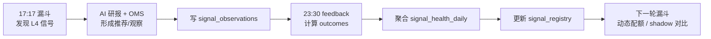

# 策略手册

本文档描述 WyckoffAgent 的策略框架与执行流程。

设计理念：主线发现 + 量价确认 + 结构化风控 + 人机协同。系统先用全市场数据发现 A 股主线和候选车道，再用日线/尾盘确认过滤买点，最后交给 AI 语义复核和 OMS 风控。

覆盖模块：
- Step2 漏斗选股：`workflows/wyckoff_funnel.py` + `core/wyckoff_engine.py` + `core/mainline_engine.py`（基础过滤、主线发现、候选车道、买点确认与打分）
- Step3 AI 研报：`workflows/step3_batch_report.py`（三阵营审判）
- Step4 持仓决断：`workflows/step4_rebalancer.py`（持仓管理、OMS 风控与 Telegram 工单）
- 跨市场扫描：`scripts/market_funnel_job.py`（港股 / 美股独立 universe + TickFlow 日线）

> 架构、数据表、定时任务见 [docs/ARCHITECTURE.md](docs/ARCHITECTURE.md)。术语速查见 [GLOSSARY.md](GLOSSARY.md)。

---

## 0. 术语速查

| 缩写 | 全称 | 含义 |
|------|------|------|
| RPS | Relative Price Strength | 涨幅百分位排名，90 = 跑赢 90% 的股票 |
| RS | Relative Strength | 个股涨幅 - 大盘涨幅 |
| ATR | Average True Range | 平均每日真实波动幅度，用于动态止损 |
| SOS | Sign of Strength | 放量突破，吸筹结束的信号 |
| LPS | Last Point of Support | 缩量回踩，最后支撑点 |
| EVR | Effort vs Result | 放量不跌，量价背离 |
| Spring | 终极震仓 | 跌破支撑后迅速收回 |
| Compression | 压缩蓄势 | 连续窄幅缩量，爆发前的能量压缩状态 |
| SLTP | Stop Loss & Take Profit | 止损止盈退出机制 |

---

## 1. 系统调度与数据工程

### 定时调度

由 GitHub Actions 在北京时间周日到周四 17:17 自动执行；周日会正常为周一实盘准备候选，只有次日不是 A 股交易日时，`scripts/daily_job.py` 才会在主流程前跳过。交易日判定由 `utils/trading_clock.py` 负责。

### 数据窗口

漏斗、研报、回测统一使用 **320 个交易日**窗口，确保 MA200 计算稳定。

### 快照机制

每轮全量拉取后，行情数据序列化到 `data/funnel_snapshots`。这使得计算与网络完全分离——回测和调参全程离线，不需要重复拉数据。

### 信号反馈闭环

A 股主漏斗和 feedback 是错峰运行的反馈系统，不是同一任务里的强同步步骤。漏斗先产出信号样本，feedback 盘后验收，下一轮漏斗再读取新的策略状态。



`FUNNEL_DYNAMIC_POLICY` 控制反馈结果如何介入：

| 模式 | 策略行为 |
|------|----------|
| `off` | 使用静态 Trend / Accum 配额。 |
| `shadow` | 真实输出仍走静态配额，同时用 signal health、registry 和策略归因调权模拟动态策略会新增/移除哪些候选。 |
| `on` | 正式使用信号健康度权重、registry 状态和策略归因调权。 |

Shadow 结果落在 `signal_policy_shadow_runs`，用于观察动态策略是否真的比静态配额更聪明。
策略归因报告使用最近 60 天样本生成；漏斗和尾盘读取归因调权时默认要求报告不超过 7 天，超过
`STRATEGY_ATTRIBUTION_MAX_AGE_DAYS` 会自动跳过，避免陈旧市场风格继续影响当前候选。
归因执行态同时暴露给 Agent：CLI 使用 `query_history(source="attribution")`，Web 读盘室使用
`query_attribution`。回答前应先看归因数据来源：CLI/MCP 会暴露 `latest_source` 和 `remote_error`，
并在远端表与本地 no-write 报告同时存在时按 `report_date` 取最新；Web 只读取远端
`strategy_attribution_reports`。随后读取 `latest_execution_state` 判断当前调权影响尾盘、
漏斗 shadow 还是正式漏斗，读取 `next_action` / `promotion_status` / `promotion_checklist` 判断 dynamic 是否只进入人工晋级评审，
并读取 `latest_operations` 查看最新 shadow 新增/移除样本和 scoped 调权明细。`manual_review_dynamic_on`
和 `manual_review_required`
只表示 shadow 数据已经过主要量化门槛；切换 `FUNNEL_DYNAMIC_POLICY=on` 仍要人工确认多期报告和回测。

### 外部观察验证

人工关注、社区反馈或其它系统给出的股票可以通过 `external_seeds` 加入观察池。它们不属于正式候选来源，不会进入 AI 推荐池，只记录在 `external_seed_observations`：

- 通过 L1/L2：说明候选本身已经符合主路径。
- L2 未过但 L4 确认：补写 `signal_observations`，`selection_mode=external_seed_shadow`，后续用 outcomes 验证。
- 未确认：只进入 watch，有效期结束后由 maintenance 清理。

### 跨市场 universe

A 股主漏斗仍使用本地股票池和行业映射；港股、美股、ETF 的代码与名称元数据维护在 `data/market_universes/*.json`。港股 / 美股漏斗使用 TickFlow 批量日线接口拉取 320 个交易日窗口，和 A 股主流程保持相同的结构识别口径，但不走 A 股专属的 Tushare 兜底。

### 盘前风控

每日 08:20（北京时间）监测 A50 期指和 VIX，判定四档风险：

| 档位 | 含义 |
|------|------|
| NORMAL | 无异常 |
| CAUTION | 情绪扰动，轻仓试探 |
| RISK_OFF | 显著风险，收缩仓位 |
| BLACK_SWAN | 黑天鹅，冻结买入 |

---

## 2. Step2：主线发现 + 多车道漏斗

### 前置：大盘水温总闸

通过指数均线关系和市场广度判定水温（NEUTRAL / RISK_ON / RISK_OFF / CRASH），动态调节漏斗参数：
- 冷水温提高门槛
- CRASH 时门槛提至极限
- 热水温适度放宽

**强力悬崖检测**：监测主板和小盘股单日暴跌 + 市场广度断崖式下降，触发即切入 CRASH。

### L1：流动性过滤

- 默认纳入主板、创业板、科创板
- 剔除 ST、北交所等非目标板块
- 市值 ≥ 35 亿
- 近 20 日均成交额 ≥ 5000 万

### L2：八通道强度筛选

不同位置的股票用不同策略筛选，八个通道互不干扰。L2 是“结构强度层”，不是最终买点：

| 通道 | 核心逻辑 | 关键条件 |
|------|---------|---------|
| 主升 | 趋势已确立的强势股 | MA50 > MA200，RPS50 ≥ 75，RPS120 ≥ 70，乖离 ≤ 25% |
| 点火 | 低位突然爆发 | 单日放量突破，RPS120 达到底线，防止纯消息一日游 |
| 潜伏 | 强股回调到年线 | RPS120 ≥ 70 但 RPS50 ≤ 45，距 MA200 ≤ 8% |
| 吸筹 | 底部横盘窄幅震荡 | 距年低 ≤ 35%，60 日振幅 ≤ 30%，均线胶着，量能萎缩 |
| 地量 | 卖压耗尽 | 距年低 ≤ 35%，10 日内出现 60 日量的 5% 分位地量 |
| 护盘 | 大盘跌它不跌 | 大盘创新低且放量，个股拒绝新低且缩量 |
| 趋势延续 | 主线强趋势不断档 | RPS120 强、回撤受控、量能不枯竭，不受年线乖离硬卡死 |
| 加速突破 | 题材从底部刚开始扩散 | 站上 MA50，短期 RPS/涨幅/量能同步爆发，允许 MA50 尚未完全上穿 MA200 |

### 主线引擎：可绕过 L2，不绕过买点

`core/mainline_engine.py` 并联在 L1 之后，解决 CPO、存储、AI PCB、先进封装、国产算力等 A 股主线先走出来、传统 L2 尚未完全确认的问题。

- 候选来源：概念热度、概念映射、主题雷达、财务指标和可选人工观察池。
- 默认不写死主题，`config/profiles/a_share_prod.yml` 中 `themes: []` / `core_basket: []` 表示动态发现。
- 主线票可以绕过 L2 强度层，但必须通过 `timing_score`，不能绕过买点确认。
- 输出分三类：`主线买点候选`、`主线观察`、`过热不追`；只有 `主线买点候选` 才进入正式 AI 候选。
- 主线买点包括：主线回踩 MA20、主线平台再突破、主线缩量强承接。
- 硬性禁止：离 MA20 过远追高、放量长上影、跌破确认支撑、主题缩量阴跌。

### L3：板块共振

- 计算行业/概念通过率和强度，动态选出保留板块
- 核心热门板块：直通
- 次优板块：个股强度 ≥ 0.60
- 超强个股：强度 ≥ 0.80 可无视板块限制
- 概念主线和强个股允许绕过固定 Top-N 行业限制，避免小题材被行业统计吞没
- L3 幸存者、候选车道和主线候选统一合并后排序

### L4：威科夫触发信号

对个股做日线级别的微观形态捕捉。L4 仍是传统威科夫票的核心买点层，主线票则使用主线 timing gate：

| 信号 | 含义 | 核心条件 |
|------|------|---------|
| SOS | 放量突破 | 涨 ≥ 4.5%，量 ≥ 2 倍且破 95 分位 |
| Spring | 假跌破后收回 | 跌破 60 日支撑，当日放量收回 |
| LPS | 缩量回踩 | 回踩 MA20，近期量 ≤ 前 60 日均量的 48% |
| EVR | 放量不跌 | 量 ≥ 1.3 倍，换手 ≥ 1%，跌幅 ≤ -2% |
| Compression | 压缩蓄势 | 近 5 日 ATR 低于 20 日 ATR 的 20% 分位 + 量能萎缩至 70% 以下 |
| Trend Pullback | 趋势回踩 | 强趋势内 5%-20% 回撤，回落缩量，未破关键均线 |

### L5：退出信号

对已持有标的检测止损和派发预警信号。

---

## 3. Step3：AI 研报

### 特征切片（不喂原始 K 线）

输入给 AI 的不是几百天的 OHLCV 表格，而是压缩后的结构特征：
- 均线位阶和乖离状态
- 近 15 日量价切片（缩量确认日、异动日）
- 过去 60 天内的高光事件（地量、暴量、突破、Spring 等）

### 候选车道

候选队列按来源和位阶拆为多个车道：
- **Trend 轨道**：主升 + 点火 + 趋势延续 + 加速突破
- **Accum 轨道**：潜伏 + 吸筹 + 地量 + 护盘
- **Mainline 轨道**：动态主线候选，必须有明确主题原因、财务/质量分、量价 timing 证据
- **Candidate Lane**：L1 通过但传统 L2/L4 尚未完全成形的趋势回踩、强承接、平台突破观察样本

按大盘水温、候选质量和主线配额动态分配容量。主线候选每日有独立上限，避免报告刷屏。

### 三阵营审判

AI 以威科夫视角对每只候选做分类：

| 阵营 | 含义 |
|------|------|
| 逻辑破产 | 结构已坏，不可碰 |
| 储备营地 | 有潜力但还没到动手时机 |
| 起跳板 | 结构到位，可操作 |

AI 必须基于传入的实际收盘价给出买入区间、确认条件和结构止损，不得自创数字。

### RAG 防雷

最后一步用外部新闻检索扫描负面信息（立案、造假、退市风险），命中则一票否决。

---

## 4. Step4：OMS 持仓决断

OMS 是系统的最终刹车——AI 的输出只是"建议"，执行权在风控引擎。

### 优先级

```
EXIT（强制止损）> TRIM（止盈）> HOLD > PROBE / ATTACK（建仓）
```

### 极寒熔断

当大盘 CRASH 或盘前风险 RISK_OFF/BLACK_SWAN 时，冻结买入权限。

### 止损继承

对已有持仓，无条件继承用户实盘止损线。新风控水位只能收紧（上移止损），不允许放宽。

### 双轨退出

| 持仓类型 | 止损逻辑 |
|---------|---------|
| 吸筹股（底部） | 建仓底部 -7% 为硬止损，涨 15% 开启移动止损 |
| 主升股（高位） | 近期高点回撤 -10% + MA50 防守；高位缩量盘跌触发派发警告 |

### 其他规则

- ATR 动态跟踪止损
- 开盘滑点溢价保护
- 买入硬止损上限 -7%
- A 股 100 股整数约束

---

## 5. 设计哲学

1. **先选环境，再选股** — 大盘广度和均线把风险期一刀切屏蔽
2. **先入视野，再等买点** — 主线票可以先进观察池，但只有回踩、平台突破或缩量承接确认后才允许操作
3. **AI 是参谋，不是决策者** — 模型建议必须经过 OMS 风控才能执行
4. **宁可错过，不硬抗** — 悬崖检测 + OMS 冻结，把躲避黑天鹅做成被动技能
5. **离线高频引擎** — 快照机制让参数调优和回测在秒级完成
