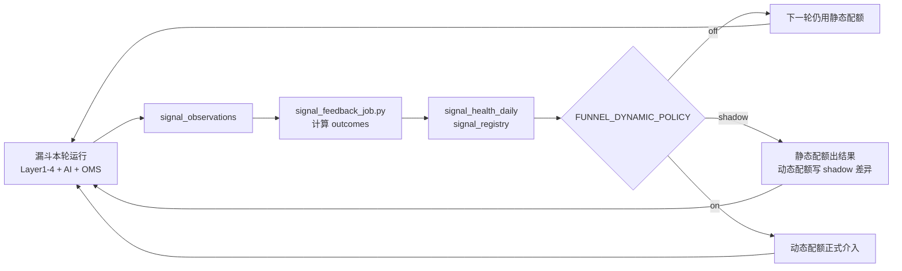

# 系统架构

[← 返回 README](../README.md)

> 本文是当前架构、数据表、Actions 与缓存口径的事实文档。
> 策略逻辑见 [`../README_STRATEGY.md`](../README_STRATEGY.md)；**实盘操作**见 [`OPERATOR_PLAYBOOK.md`](OPERATOR_PLAYBOOK.md)；A 股链路见 [`A_SHARE_FUNNEL_FLOW.md`](A_SHARE_FUNNEL_FLOW.md)。

## 系统全景

```
     ┌──────────────┐  ┌──────────────┐  ┌──────────────┐  ┌──────────────┐
     │ React Web    │  │  CLI (TUI)   │  │  MCP Server  │  │  GitHub      │
     │ (CF Pages)   │  │  Terminal    │  │  (stdio)     │  │  Actions     │
     └──────┬───────┘  └──────┬───────┘  └──────┬───────┘  └──────┬───────┘
            │                 │                 │                 │
            ▼                 ▼                 ▼                 ▼
     ┌─────────────────────────────────────────────────────────────────────────────────┐
     │                              Agent Brain                                        │
     │              React: Vercel AI SDK · CLI: AgentRuntime · MCP                     │
     │                                                                                 │
     │  CLI 21 tools · Web 13 tools · MCP 15 tools — 按通道权限编排                      │
     │  提示词驱动规划 — 复杂任务先列步骤再执行                                          │
     └──────────────────────────────┬──────────────────────────────────────────────────┘
                                    │
          ┌─────────────────────────┼──────────────────────────────┐
          ▼                         ▼                              ▼
   ┌─────────────┐         ┌──────────────┐              ┌──────────────┐
   │ Core Engine │         │ LLM          │              │ Storage      │
   │             │         │              │              │              │
   │ Funnel      │         │ Gemini  ★    │              │ Supabase     │
   │ Diagnostic  │         │ Claude       │              │ SQLite 本地  │
   │ Strategy    │         │ OpenAI       │              │  (离线缓存)  │
   │ Signal      │         │ DeepSeek     │              │ CF Pages     │
   │ Sector      │         │ Qwen/兼容端点│              │  (边缘代理)  │
   │ Tail-Buy    │         │ 智谱/火山    │              └──────────────┘
   └──────┬──────┘         │ Minimax      │
          │                │ 1Route       │
          ▼                └──────────────┘
   ┌─────────────┐
   │ Data Sources│
   │             │
   │ tickflow ★  │
   │ tushare     │
   │ akshare     │
   │ baostock    │
   │ efinance    │
   └─────────────┘
```

## React Web App（Cloudflare Pages）

### 架构概览

```
浏览器 (React SPA)
  │
  ├─→ Supabase (Auth + DB)     ← Auth、白名单、配置、持仓、复盘表等仍按 RLS 直连
  │
  ├─→ /api/chat/*              ← Pages Function 转发到 Hono Worker API
  │       │
  │       └─→ Vercel AI SDK streamText + tools + 协议层工具审批
  │
  ├─→ /api/llm-proxy/*         ← 兼容代理，用于行情/LLM 直连能力
  │       │
  │       └─→ X-Target-URL 头指定目标 → TickFlow / Tushare / DeepSeek / OpenAI / 1Route / ...
  │
  └─→ 静态资源 (CF Pages CDN)
```

**为什么需要 API 层与边缘代理？**

读盘室主链路已经后端化到 `web/apps/api/src/routes/chat.ts`：Worker 负责读取用户模型配置、执行工具、限流、返回 UIMessage stream，并通过 Vercel AI SDK 的 approval parts 约束 `execute_portfolio_update`。`web/functions/api/chat/[[path]].ts` 只是把同域 Pages 请求转给这套 Hono app。

`/api/llm-proxy/*` 继续保留为兼容代理：一部分 Web 工具和本地开发路径仍需要同域转发 TickFlow / Tushare / OpenAI-compatible 请求，避免浏览器 CORS 和供应商 SSE 差异。

代理只接受受信 Web Origin（无 `Origin` 的 CLI 请求继续兼容）、`GET/POST`、2 MiB 以内请求，并限制到 HTTPS 白名单上游；服务端模型 `base_url` 同样拒绝凭据、非标准端口、loopback、私网和 link-local 地址，且不跟随重定向。

CLI Agent 的本地命令工具只允许明确的只读命令；文件工具继续执行隐藏目录、凭据文件和系统目录阻断。`web_fetch` 每一跳重定向都重新验证 DNS/IP/端口。本地 Dashboard 使用进程级随机令牌及 Host/Origin 校验，不把绑定 `127.0.0.1` 当作唯一安全边界。云端用户凭据只从该用户上下文读取，不回退到运维者本机配置或环境变量。

### 技术栈

| 层 | 技术 |
|---|---|
| 框架 | React 19 + React Router 7 + TypeScript |
| AI SDK | 前端 `@ai-sdk/react` + Worker 端 `ai` / `@ai-sdk/openai` / `@ai-sdk/anthropic` |
| 样式 | Tailwind CSS 4 + shadcn/ui 组件 |
| 构建 | Vite 6 → CF Pages 部署 |
| API 层 | Hono Worker app（`web/apps/api/src/index.ts`），由 Pages Function `/api/chat` 转发 |
| 兼容代理 | CF Pages Functions（`web/functions/api/llm-proxy/[[path]].ts`） |
| 状态管理 | Zustand（auth store） |
| 数据 | Supabase JS SDK 直连 |

### 页面结构

| 路由 | 页面 | 功能 |
|------|------|------|
| `/chat` | 读盘室 | Agent 多轮对话、漏斗筛选、研报生成、模型快速切换 |
| `/analysis` | 单股分析 | 输入代码 → K 线图 + LLM 诊断 |
| `/portfolio` | 持仓 | 持仓明细 + 收益率 |
| `/tracking` | 跟踪 | 形态复盘 + 涨跌幅 |
| `/tail-buy` | 尾盘记录 | 尾盘策略执行历史 |
| `/export` | 数据导出 | CSV 导出 |
| `/guide` | 功能说明 | Web 端功能入口和日常工作流说明 |
| `/settings` | 设置 | 模型 / API Key / 数据源配置 |

### Provider Stream 兼容

读盘室走 `/api/chat` 的 UIMessage stream，Worker 端根据用户设置创建 OpenAI-compatible 或 Anthropic provider。Gemini OpenAI-compatible SSE 会经过 `normalizeGeminiStream()` 归一化，避免工具调用 chunk 在前端缺失。旧的 `/api/llm-proxy` 路径仍服务单股、多股、导出等非读盘室直连能力。

### 与 CLI 的能力差异

网页版 Agent 有浏览器侧历史和摘要式上下文压缩，但不接入 CLI 的 SQLite 跨会话记忆、scratchpad、sub-agent 和 TUI 后台任务面板。完整本地能力体验请移步 CLI。

---

## Agent 架构

### 三通道复用

React Web、CLI、MCP 共享核心金融引擎、行情/存储集成和部分业务能力，但不强行共享同一套 runtime 或同一份 System Prompt。CLI / MCP 的 Python 工具按职责拆在 `agents/diagnosis_tools.py`、`agents/screen_tools.py`、`agents/report_tools.py`、`agents/strategy_tools.py` 等模块；Web 读盘室由 `web/apps/api/src/routes/chat.ts` 承载 agent loop，工具实现集中在 `web/packages/shared/src/chat-tools.ts`，前端用 `@ai-sdk/react` 渲染 UIMessage parts。

| | React Web (CF Pages) | CLI（TUI） | MCP Server |
|---|---|---|---|
| 运行时 | Worker 端 Vercel AI SDK `streamText` + 前端 `useChat` | `AgentRuntime`（`cli/runtime.py`） | FastMCP（stdio） |
| UI | React SPA | Textual 全屏 TUI | 无（被 Claude Code 等调用） |
| 入口 | `web/apps/web/` + `web/apps/api/` | `wyckoff`（无子命令） | `wyckoff-mcp` |
| 工具数 | 14（TS 独立封装） | 21（含本地工具 / Skill / 委派） | 15（三层权限） |
| 部署 | CF Pages + Hono Worker/Functions | 本地 pip 安装 | 本地进程 |
| 对话能力 | ✓ maxSteps 多轮 | ✓ Agent Loop 多轮 | ✗ 单次工具调用 |
| 后台任务 | ✗（只查询或发起轻量 API） | ✓ 长任务非阻塞 | ✗ |
| 消息排队 | ✓ 前端队列，最多 5 条等待当前回复完成 | ✓ Agent 忙时自动排队 | N/A |
| Thinking | 取决于 provider stream；Gemini SSE 做归一化 | ✓ 推理模型 reasoning 展示 | N/A |
| Agent 记忆 | ✗ | ✓ 跨会话记忆（SQLite） | ✗ |
| 上下文压缩 | ✓ 最近对话压缩 | ✓ 按剩余窗口预算自动压缩 | N/A |
| 可视化面板 | ✗ | ✓ `wyckoff dashboard` | ✗ |
| 规划能力 | ✗ | ✓ prompt 驱动（非交互式 Plan Mode） | N/A |

Streamlit 框架在 MVP 阶段支撑了产品验证，但主分支已全面下线 Streamlit：运行代码、依赖和 CI 路径均不再维护。历史代码保留在 `release/streamlit` 分支，MVP 产品架构和效果图归档在 [`STREAMLIT_MVP_ARCHITECTURE.md`](STREAMLIT_MVP_ARCHITECTURE.md)。

当前 CLI 主力 agent loop 收敛在 `cli/runtime.py::AgentRuntime`：它负责 provider 调用、工具执行、并发分批、上下文压缩、retry、doom-loop、scratchpad 和大结果落盘。React Web 读盘室则以 `web/apps/api` 的 Hono Worker + Vercel AI SDK 承载在线 agent loop。

**CLI 专属工具**（Web / MCP 不可用）：`exec_command`、`read_file`、`write_file`、`web_fetch`、`check_background_tasks`、`ask_user`、`execute_skill`、`delegate_to_research`、`delegate_to_analysis`、`delegate_to_trading`

**MCP 三层权限**：
- Tier 1（无需凭证）：历史查询（`query_history`）— 形态复盘、信号池、尾盘记录和策略归因只读摘要
- Tier 2（需 TUSHARE_TOKEN / TICKFLOW_API_KEY 等 env）：搜索、分析（`analyze_stock`）、大盘、扫描、回测、盘中结构和漏斗仿真
- Tier 3（需 Supabase 用户认证或本地降级）：持仓管理（`portfolio` / `update_portfolio`）、AI 研报、攻防决策

### ReAct 循环（Reasoning + Acting）

Agent 采用 ReAct 范式：每一轮 LLM 先推理（Reason），再决定是否行动（Act），观察工具结果（Observe）后进入下一轮推理，直到能直接回答用户。

```
                        ┌──────────┐
                        │  用户输入  │
                        └────┬─────┘
                             │
                   ┌─────────▼──────────┐
                   │  Reason            │
                   │  LLM 推理 + 规划   │◄───────────┐
                   │  (thinking/text)   │            │
                   └─────────┬──────────┘            │
                             │                       │
                    ┌────────┴────────┐              │
                    │  需要 Act?      │              │
                    └───┬─────────┬───┘              │
                     No │         │ Yes              │
                        ▼         ▼                  │
                  ┌──────────┐  ┌──────────────┐     │
                  │ 输出回答  │  │  Act         │     │
                  └──────────┘  │  执行工具     │     │
                                │              │     │
                                │ 后台工具?     │     │  Observe
                                │  ├─Y→ submit │     │  工具结果
                                │  └─N→ 同步   │     │  注入上下文
                                └──────┬───────┘     │
                                       └─────────────┘
                                    (最多 15 轮)
```

### 工具注册口径

| 通道 | 当前工具 |
|------|----------|
| CLI / TUI（21） | `search_stock_by_name`、`analyze_stock`、`portfolio`、`get_market_overview`、`get_market_history`、`screen_stocks`、`generate_ai_report`、`generate_strategy_decision`、`query_history`、`update_portfolio`、`check_background_tasks`、`run_backtest`、`ask_user`、`execute_skill`、`delegate_to_research`、`delegate_to_analysis`、`delegate_to_trading`、`exec_command`、`read_file`、`write_file`、`web_fetch` |
| Web（14） | `search_stock`、`view_portfolio`、`market_overview`、`market_history`、`query_recommendations`、`query_tail_buy`、`query_attribution`、`plan_portfolio_update`、`execute_portfolio_update`、`analyze_stock`、`screen_stocks`、`generate_ai_report`、`generate_strategy_decision`、`intraday_analysis` |
| MCP（15） | `query_history`（含 `attribution`）、`search_stock_by_name`、`analyze_stock`、`get_market_overview`、`screen_stocks`、`run_backtest`、`market_regime`、`wyckoff_diagnose`、`intraday_analysis`、`intraday_rescue_check`、`run_funnel_simulation`、`portfolio`、`update_portfolio`、`generate_ai_report`、`generate_strategy_decision` |

CLI 中 `screen_stocks`、`generate_ai_report`、`generate_strategy_decision`、`run_backtest` 会提交到 `BackgroundTaskManager`（daemon Thread），不阻塞对话。Web 的 `screen_stocks` 读取最新漏斗结果，不在浏览器会话里启动本地后台漏斗。MCP 只返回单次工具调用结果。

**调仓确认机制差异**：
- CLI：仍使用单一 `update_portfolio` 工具，确认通过 TUI 弹窗实现（用户在终端确认操作）
- Web：拆为 `plan_portfolio_update` → 用户在聊天中确认 → `execute_portfolio_update`，由 Vercel AI SDK approval parts 在协议层要求确认

**Tool Schema 策略差异**：
- CLI：OpenAI SDK 默认不开 `strict`，工具参数可用 Python `Optional[T]`（字段不在 required 中）
- Web（CF Pages）：`@ai-sdk/openai` 的 `compatibility: 'compatible'` 模式自动开启 `strict: true`，要求所有字段必须在 `required` 中。可选参数使用 Zod `.nullable()` 而非 `.optional()`，生成 `"type": ["string", "null"]` 使字段留在 required 中、模型不需要时传 null

### 工具路由原则

System Prompt 内建路由规则，LLM 自主判断调哪个工具：

- "我有什么持仓" → `portfolio(mode="view")`（纯数据，秒回）
- "持仓健康吗" → `portfolio(mode="diagnose")`（逐只诊断，较慢）
- "帮我加/删持仓" → Web 使用 `plan_portfolio_update` → 用户确认 → `execute_portfolio_update`；CLI 使用 `update_portfolio` 并由 TUI 弹窗确认
- "有什么机会" → `screen_stocks`（后台执行）

**铁律：一个工具能回答的问题，绝不调两个。用户没要求分析，就不要分析。**

### 提示词驱动规划

复杂任务（≥2 个工具）会通过 system prompt（系统提示词）要求模型先列出分步计划，再逐步调用工具执行：

```
用户: "帮我全面分析一下现在的市场"
  │
  ▼
Agent 输出计划:
  1. 查大盘水温 → get_market_overview
  2. 全市场扫描 → screen_stocks（后台）
  3. 诊断持仓 → portfolio(mode="diagnose")
  4. 综合建议
  │
  ├─→ 逐步执行，每步汇报进度
  ├─→ 步骤间可动态调整（如大盘极弱则跳过进攻）
  │
  ▼
最终综合结论
```

当前 CLI 没有独立的 `/plan` 命令，也没有“先生成计划、等待用户确认、再执行工具”的交互式 Plan Mode（计划模式）状态机。运行时默认让模型负责自然语言理解、上下文恢复和任务拆分；代码只在两类场景做确定性治理：

- 设置 `WYCKOFF_STRICT_TOOL_EXPECTATIONS=1` 或测试显式开启时，`loop_guard` 才会按旧式 turn expectation 注入 retry message（重试消息），用于诊断模型漏调工具，不作为默认聊天路径。
- 高风险工具（`update_portfolio`、`exec_command`、`write_file`）执行前由 TUI 弹窗确认，避免写操作直接落地。

### 后台任务架构

`cli/background.py` — `BackgroundTaskManager`

```
Agent → tool_call: screen_stocks
  │
  ├─→ ToolRegistry 检测为 BACKGROUND_TOOLS
  │   {"screen_stocks", "generate_ai_report", "generate_strategy_decision", "run_backtest"}
  │
  ├─→ BackgroundTaskManager.submit() → daemon Thread 执行
  ├─→ 立即返回 {"status": "background", "task_id": "bg_xxx"}
  │
  ▼
Agent → "已提交后台，可继续提问"
  │
  │   （用户继续聊天...）
  │
  ▼   （后台线程完成）
on_complete 回调 → TUI 显示通知 → 结果注入消息队列 → Agent 自动汇报
```

### 消息排队

CLI/TUI 队列：

```
用户输入 → Agent 忙? ─No→ 立即处理
                      │
                      Yes→ 入 deque 队列，显示 "⏳ 已排队 (N)"
                              │
                              ▼ （当前任务完成后）
                         自动取队首消息 → 继续处理
```

`/new` 清对话时同步清空队列。

Web 读盘室队列：
- 前端 `useMessageQueue()` 在当前回复未完成时把新输入排队，最多保留 5 条。
- 当前 assistant message 完成后自动发送队首消息，并复用同一套 `/api/chat` transport。
- 用户可手动清空队列；页面刷新会丢弃未发送队列，避免误把临时输入写进数据库。

### CLI Provider 层

```
LLMProvider (abstract)              cli/providers/base.py
  │
  ├── GeminiProvider                google-genai SDK
  ├── ClaudeProvider                anthropic SDK
  ├── OpenAIProvider                openai SDK + base_url + reasoning_content
  └── FallbackProvider              多模型路由，按可用性自动切换
```

统一接口：`chat_stream(messages, tools, system_prompt) → Generator[chunk]`

chunk 类型：`thinking_delta` | `text_delta` | `tool_calls` | `usage`

OpenAI provider 兼容所有 OpenAI API 格式端点（DeepSeek / Qwen / Kimi / LongCat / Minimax 等），支持推理模型的 `reasoning_content` thinking 流，以及 `<tool_call>` XML 标签兜底解析。

### MCP Server

`mcp_server.py` — 通过 [Model Context Protocol](https://modelcontextprotocol.io) 将 Wyckoff 分析能力暴露给外部 AI Agent（Claude Code、Cursor 等）。

```
Claude Code / Cursor / 其他 MCP 客户端
  │
  ├─→ stdio 连接 → wyckoff-mcp 进程
  │
  ├─→ MCP 协议 → FastMCP 路由 → chat_tools.py 中的函数
  │
  └─→ 工具结果 JSON ← 返回
```

**与 CLI / Web 的关键区别**：MCP Server 不具备对话能力，它只是一个工具服务——LLM 的推理和多轮编排由外部客户端（如 Claude Code）负责，Wyckoff MCP 只响应单次工具调用。

安装与注册：

```bash
pip install youngcan-wyckoff-analysis[mcp]
claude mcp add wyckoff -- wyckoff-mcp
```

凭证通过环境变量注入（`TUSHARE_TOKEN`、`SUPABASE_*`），或由 `_get_credential` 自动从 `~/.wyckoff/wyckoff.json` 读取。

### TUI 视觉层次

```
❯ 用户问题                           ← cyan 粗体

  💭 推理摘要…  (1234 字)             ← thinking：一行，dim italic
  ⚙ 搜索股票  keyword=宁德           ← tool 执行：黄色
  ✓ 搜索股票  0.3s                   ← tool 完成：绿色
  ✗ 调取行情  1.2s 超时              ← tool 失败：红色
  ↗ 全市场扫描  已提交后台            ← 后台任务：cyan
  ───                                ← 分隔线
  最终 Markdown 输出...              ← Markdown 渲染

  ↑1,234 ↓567 · 2.3s               ← token 统计：dim
```

## Agent 记忆系统

`cli/memory.py` — 跨会话分层记忆，存储在 SQLite `agent_memory` 表。设计吸收 TencentDB-Agent-Memory 的两条核心原则：高层保留结构，低层保留证据；压缩可以折叠，但必须能下钻。

### 写入时机

三种触发路径：
- **`/new`**：开启新会话时保存上一轮
- **退出 TUI**（`/quit`、`/exit`、Ctrl+Q）：后台线程保存，5s 超时
- **Ctrl+C**：同上

满足以下条件自动提取：
- 消息数 ≥ 4
- 至少有 1 次工具调用

LLM 从最近 40 条消息中提取 L1 原子记忆（≤300 字），当前只抽取两类稳定信息：

- `[决策]` → `decision`
- `[偏好]` → `preference`

系统不自动沉淀具体股票买卖事实、临时调仓记录或每日市场状态；这些信息应从持仓表、推荐表、行情表查询，避免旧观点污染当前判断。

如果一条 L1 内容自身包含 6 位代码或明确股票名称，写入前会用本地股票名称缓存解析成 `codes`，用于后续确定性召回；没有明确股票的全局交易纪律保持 `codes=''`，避免被错误绑定到当前会话里出现过的所有股票。

当 L1 `preference` / `decision` 总数达到 3 条以上，并且最近 L1 原子记忆相对上一轮蒸馏有足够新增时，系统会读取最近最多 30 条 L1 原子记忆，提炼 L2 `playbook` 和 L3 `persona`，用于下一轮更高密度召回。

### 分层与追溯

| 层级 | 载体 | 作用 | 下钻方式 |
|------|------|------|---------|
| L0 | `chat_log` / scratchpad / tool result 文件 | 原始对话与工具证据 | `source_ref=chat_log:<session_id>` 或 `result_ref` |
| L1 | `agent_memory` 原子记忆 | 用户偏好、非显而易见的决策逻辑 | `wyckoff memory trace <id>` |
| L2 | `playbook` | 条件化交易剧本：适用条件、动作、硬性禁忌或退出条件 | 关联 L1 原子记忆和股票代码 |
| L3 | `persona` | 用户画像、稳定风险边界 | 需要细节时回查 L1/L0 |

历史 `scenario` 记录仅做兼容召回；新生成的 L2 统一写入 `playbook`。

`agent_memory` 新增 `memory_level`、`source_ref`、`confidence`、`metadata` 字段。TUI 在保存记忆时写入 `source_ref=chat_log:<session_id>`，CLI 可用 `wyckoff memory trace <id>` 查看来源会话片段。

### 自动清理

TUI 启动时自动执行 `prune_memories()`，按类型清理旧记忆：L1 `decision` 保留 45 天，L2 `playbook` / legacy `scenario` 保留 60 天，`preference` 和 `persona` 长期保留。

### 检索注入

每次用户提问前，Hybrid Search 综合检索 + 画像/偏好置顶：

1. **FTS5 全文检索**（权重 0.8）：SQLite FTS5 索引，BM25 排序，精准匹配用户问题中的关键词
2. **股票实体匹配**（权重 1.2）：先解析 6 位代码，再用本地股票名称缓存把“宁德时代”“比亚迪”映射为确定性代码
3. **中文关键词 LIKE**（权重 0.25）：2-gram 分词 + 停用词过滤，补充召回；“建仓”“买入”“止损”等泛交易词不作为独立召回依据
4. **时间衰减加权**：默认半衰期 14 天；L1 `decision` 为 14 天，L2 `playbook` / `scenario` 为 21 天，`preference` / `persona` 不衰减
5. **股票作用域过滤**：当前问题有明确股票时，只保留全局记忆和同代码记忆；当前问题没有明确股票时，带 `codes` 的单股记忆不参与召回
6. 始终拉取 L3 `persona` 和近期 `preference`，置顶显示，但同样遵守股票作用域过滤

拼成两段注入 system prompt 尾部：

```
# 用户画像
- 风险偏好中等，止损 -6%
- 不要推荐 ST 股

# 交易剧本
- #18 [2026-05-15] 尾盘二次确认买入：适用已确认候选；动作是 14:45 后检查 VWAP、确认支撑和收位；硬性禁忌是跌破确认支撑或极端放量冲高回落

# 历史记忆
- #12 [2026-05-15] 用户不希望消息面短线噪声替代可持续主线判断 | 源:chat_log:abc123
```

### 记忆类型

| 类型 | 层级 | 来源 | 自动清理 |
|------|------|------|---------|
| `preference` | L1 | 会话摘要自动抽取：投资风格、禁忌、操作习惯 | 永不清理 |
| `decision` | L1 | 会话摘要自动抽取：非显而易见的决策逻辑/原因 | 45 天 |
| `playbook` | L2 | 从最近 L1 偏好/决策蒸馏出的条件化交易剧本 | 60 天 |
| `persona` | L3 | 从最近 L1 偏好/决策蒸馏出的稳定用户画像 | 永不清理 |
| `scenario` / `fact` / `stock_opinion` / `market_view` / `session` | L1/L2 | 本地表兼容的历史/手动类型，当前自动摘要不主动生成 | 30-60 天 |

## 上下文压缩

`cli/compaction.py` — TUI 和 headless agent loop 共用。

### 动态阈值

压缩触发基于 context window（上下文窗口）的剩余预算，而不是“已用 25% 就压缩”。窗口大小优先来自模型配置里的 `context_window`，未配置时由 `cli/model_metadata.py` 统一按模型名推断；未知模型的 64K token（词元）默认值属于同一条推断链路。

系统会预留 safety reserve（安全缓冲）给 system prompt（系统提示词）、工具定义、工具结果和最终输出：

```
reserve = min(max(16_384, min(context_window * 25%, 32_768)), context_window / 2)
threshold = context_window - reserve
```

| 模型/来源 | Context Window（上下文窗口） | 预留缓冲 | 压缩阈值 |
|---------|---------------|---------|---------|
| deepseek | 64K | 16.4K | 47.6K |
| gpt-4o | 128K | 32K | 96K |
| gemini-2 | 1M | 32.8K | 967.2K |
| claude | 200K | 32.8K | 167.2K |
| 未知模型 | 64K（默认） | 16.4K | 47.6K |

### 压缩策略

1. **Memory Flush**：压缩前先用 LLM 从待压缩消息中提取用户偏好/重要事实，存入 `preference` 记忆（永不丢失）
2. 按最近上下文预算保留原文（默认最多 20K token，并至少保留最近 4 条消息）
3. 前面的消息用 LLM 总结为 ≤500 字中文摘要
4. 工具结果做智能摘要而非粗暴截断：
   - `analyze_stock` 诊断模式 → 保留 `code`、`phase`、`health`、`trigger_signals` 等关键字段
   - `analyze_stock` 行情模式 → 保留最近 5 条数据
   - `portfolio` 诊断模式 → 保留 `diagnostics`、`successful_count` 等
   - `portfolio` 查看模式 → 保留 `positions`、`free_cash` 等
   - 通用工具 → 保留 `error`、`message`、`status` 等顶层键
5. 超过 inline 预算（默认 8,000 字符）的工具结果由 `cli/tool_results.py` 写入 `~/.wyckoff/tool-results/*.json`，上下文只保留 `node_id`、`result_ref`、Mermaid 节点和预览；`index.jsonl` 记录节点到原文文件的映射，便于按 `node_id` 下钻。

```
[对话摘要]
用户查询了平安银行和贵州茅台的诊断...
---
[最近 4 条原始消息]
```

### 工具确认机制

高风险写操作工具需用户确认后才执行。CLI/TUI 使用本地确认弹窗；Web 读盘室使用 UIMessage approval parts，`execute_portfolio_update` 在前端确认前不会落库：

| 工具 | 风险等级 |
|------|---------|
| `exec_command` | 高（执行任意命令） |
| `write_file` | 高（写入文件） |
| `update_portfolio` | 中（修改持仓或删除记录） |
| `execute_portfolio_update` | 中（Web 修改持仓，协议层确认） |

CLI 确认选项：允许一次 / 本次会话总是允许 / 修改后执行 / 不允许。Web 确认选项：确认执行 / 拒绝。

### Doom Loop 防护

滑动窗口检测（最近 6 次调用），两种触发条件：
- **精确匹配**：同名工具 + 相同参数 hash ≥3 次 → 中止
- **语义相似**：同名工具 + 参数 Jaccard 相似度 ≥0.8（字符 3-gram）≥3 次 → 中止（防止"换汤不换药"式死循环）

### 并发工具执行

只读工具（`search_stock_by_name`、`analyze_stock`、`portfolio`、`get_market_overview`、`get_market_history`、`query_history`、`execute_skill`）连续调用时自动并行执行（ThreadPoolExecutor，最多 5 线程），写工具和带副作用工具保持串行。

## 本地可视化面板

`cli/dashboard.py` — `wyckoff dashboard [--port 8765]`

纯 Python 内置 HTTP 服务器 + 嵌入式 SPA，无外部依赖。启动后自动打开浏览器。

### 功能

| 页面 | 数据源 | 说明 |
|------|--------|------|
| 总览 | sync_meta | 各模块最后同步时间 + 行数 |
| AI 推荐 | recommendation_tracking | 入选股票 + 当前价 + 收益率，支持逐条删除 |
| 信号池 | signal_pending | L4 信号状态列表，支持逐条删除 |
| 持仓 | portfolio + positions | 当前持仓明细 |
| Agent 记忆 | agent_memory | 跨会话记忆列表，支持逐条删除 |
| 配置 | wyckoff.json | 模型配置（API Key 脱敏） |
| 对话日志 | chat_log | 按会话浏览历史对话 + token 统计，支持按会话删除 |
| Agent 日志 | agent.log | 实时查看文件日志尾部 |
| 同步状态 | sync_meta | 各表 TTL 和最后同步时间 |

### 特性

- **双主题**：暗色（Bloomberg 终端风格）/ 亮色，`localStorage` 持久化
- **双语 i18n**：中文 / English，`localStorage` 持久化
- **9 个 GET + 4 个 DELETE 端点**：GET `/api/config`、`/api/memory`、`/api/recommendations`、`/api/signals`、`/api/portfolio`、`/api/sync`、`/api/chat-sessions`、`/api/chat-log/<sid>`、`/api/agent-log`；DELETE `/api/memory/<id>`、`/api/recommendations/<code>`、`/api/signals/<code>`、`/api/chat-sessions/<sid>`

## 对话日志

### 文件日志

`~/.wyckoff/agent.log` — Python `logging.FileHandler`，记录每次对话的 session_id、用户输入、耗时、token 用量。

### SQLite chat_log 表

```sql
CREATE TABLE chat_log (
    id          INTEGER PRIMARY KEY AUTOINCREMENT,
    session_id  TEXT NOT NULL,
    role        TEXT NOT NULL,       -- user / assistant / tool / error
    content     TEXT DEFAULT '',
    model       TEXT DEFAULT '',
    provider    TEXT DEFAULT '',
    tokens_in   INTEGER DEFAULT 0,
    tokens_out  INTEGER DEFAULT 0,
    elapsed_s   REAL DEFAULT 0,
    error       TEXT DEFAULT '',
    tool_calls  TEXT DEFAULT '',     -- JSON
    metadata    TEXT DEFAULT '',     -- JSON（cache_read/cache_write/stop_reason/rounds/messages/system_prompt/tools）
    created_at  TEXT DEFAULT (datetime('now'))
);
```

`list_chat_sessions()` 按 session_id 聚合：起止时间、消息数、总 token、最后错误。

## 本地持久化（~/.wyckoff/）

| 文件 / 数据库 | 用途 |
|-------------|------|
| `wyckoff.json` | 模型配置（provider / api_key / model / base_url） |
| `session.json` | Supabase 登录态（access_token / refresh_token） |
| `agent.log` | Agent 文件日志 |
| `wyckoff.db` | SQLite 数据库（下方详述） |

### SQLite 表（wyckoff.db）

| 表 | 用途 |
|---|------|
| `schema_version` | 迁移版本管理（当前 v7） |
| `agent_memory_fts` | FTS5 全文检索索引（自动同步） |
| `recommendation_tracking` | 形态复盘镜像；主线候选保存主题、阶段、角色与评分 |
| `signal_pending` | 信号池镜像；跨日携带主线语义供 Step3/尾盘使用 |
| `market_signal_daily` | 大盘信号镜像 |
| `portfolio` | 持仓元数据镜像 |
| `portfolio_position` | 持仓明细镜像 |
| `agent_memory` | 跨会话 Agent 记忆 |
| `sync_meta` | 同步元数据（每表最后同步时间） |
| `chat_log` | 对话日志（用户输入 + LLM 输出 + token + metadata） |
| `tail_buy_history` | 尾盘策略执行历史；保存决策时的主线语义与评分快照 |
| `background_task_result` | 后台任务结果缓存 |

### Supabase → SQLite 同步

`integrations/sync.py` — TUI 启动时自动后台同步（daemon thread）。

| 表 | 同步策略 | TTL |
|---|---------|-----|
| `recommendation_tracking` | 最近 200 条 | 4 小时 |
| `signal_pending` | 最近 200 条 | 4 小时 |
| `market_signal_daily` | 最近 30 天 | 6 小时 |
| `portfolio` + `positions` | 全量覆写 | 2 小时 |

Supabase 不可达时静默跳过，使用本地陈旧数据。`wyckoff sync` 可手动触发。

## 主线漏斗引擎

`core/wyckoff_engine.py` + `core/mainline_engine.py`，通过 `FunnelConfig` 和 `MainlineEngineConfig` 控制传统量价通道、主线发现和候选车道。

| 组件 | 名称 | 逻辑 |
|----|------|------|
| L1 | 基础过滤 | 剔除 ST / 北交等非目标板块，默认纳入主板 / 创业板 / 科创板，市值 ≥ 35 亿，成交额 ≥ 5000 万，可叠加财务软过滤 |
| L2 | 八通道强度 | 主升 / 潜伏 / 吸筹 / 地量 / 暗中护盘 / 趋势延续 / 加速突破 / 点火破局 |
| Mainline | 主线发现 | 基于概念热度、概念映射、主题雷达和财务质量构建 `主线买点候选 / 主线观察 / 过热不追` |
| Candidate Lane | 候选车道 | L1 后的趋势回踩、平台突破、强承接等观察样本，避免只靠传统 Wyckoff 触发 |
| L2.5 | Markup 识别 | MA50 上穿 MA200 + 角度验证 |
| L3 | 行业/概念共振 | 过滤弱板块，同时允许强个股和主线概念绕过固定 Top-N 行业限制 |
| L4 | 微观狙击 | Spring / LPS / SOS / EVR / Compression / Trend Pullback 等触发信号 |
| L5 | 退出信号 | 初始止损 -6%、利润激活线 +15%、跟踪止损（高点回撤 -10% 或跌破 MA50）、派发警告（高位缩量 3 天） |

正式推荐不是“过某一层就买”。传统 Wyckoff 候选、主线候选和候选车道会合并进统一候选池，再经过 AI 复核、信号确认、尾盘二次确认和 OMS 风控。

## 信号确认状态机

`core/signal_confirmation.py`，L4 信号经 1-3 天价格确认：

```
pending ──(价格确认)──→ confirmed（研究确认，仍需尾盘 BUY 与市场闸门）
   └──(超时)──→ expired（失效）
```

TTL：SOS 2 天、Spring 3 天、LPS 3 天、EVR 2 天、Compression 3 天。

## 信号反馈与动态策略闭环

完整说明见 [`SIGNAL_FEEDBACK_LOOP.md`](SIGNAL_FEEDBACK_LOOP.md)。核心关系是：漏斗写观察样本，feedback 盘后验收，下一轮漏斗读取新的健康度和 registry。



| 模式 | 行为 |
|------|------|
| `off` | 默认静态 Trend / Accum 配额（NEUTRAL 5/1；RISK_ON 5/1 仅研究，禁止正式执行），不读取反馈权重。 |
| `shadow` | 主流程保持静态配额，同时把读取 health / registry / 归因调权后的动态策略候选差异写入 `signal_policy_shadow_runs`。 |
| `on` | 正式使用 `signal_health_daily` 权重、`signal_registry` 启停状态和归因调权。 |

策略归因治理器会同时输出 raw `next_action`、`promotion_status` 和 `promotion_checklist`，也输出
`latest_policy_display` / `latest_execution_summary` 给 Agent 直接展示。CLI/MCP 的
`latest_source` 和 `remote_error` 先说明读到的是远端表还是本地 no-write 报告；
`latest_operator_summary` 给出一行运营结论；`latest_execution_summary` 说明归因调权当前影响尾盘、
漏斗 shadow 还是正式漏斗；raw `next_action` / `promotion_status` 只用于追证据；
`promotion_checklist` 则把样本量、shadow 新增表现、scoped 信号调权和回测确认拆成结构化证据。

## 尾盘策略

`core/tail_buy/` + `workflows/tail_buy_config.py` + `scripts/tail_buy_intraday_job.py`

策略设计用于尾盘执行，从已确认候选中筛选买入标的；当前 GitHub Actions 工作流只保留 `workflow_dispatch`，日常 14:40 触发由外部自动化负责。

### 两阶段评估

```
signal_pending (pending/confirmed)
  │
  ├─→ 获取 1 分钟盘中数据（TickFlow）
  │
  ├─→ 第一阶段：规则打分（15+ 特征）
  │   VWAP 位置、尾盘量比、日内回撤、突破形态...
  │   BUY ≥ 72 · WATCH ≥ 52 · SKIP < 52
  │
  ├─→ 第二阶段：LLM 复判（Top N 候选）
  │   输入：规则特征 + 5 分钟摘要 + 信号上下文
  │         + candidate_theme / candidate_phase / candidate_role
  │   输出：{"decision":"BUY|WATCH|SKIP","reason":"...","confidence":0.8}
  │
  ├─→ 规则 × LLM 合并 → 最终排序
  │
  └─→ 推送飞书 / Telegram
```

主线主题、阶段和角色由程序确定，LLM 只能原样引用。`confirmed`、起跳板和主线核心均不自动等于 BUY；模型不计算金额、仓位比例或股数，执行规模由 OMS 决定。

### 持仓监控

同一任务还扫描当前持仓，输出 HOLD / ADD / TRIM 建议。

## Pipeline（定时任务）

### 飞书报告卡片

所有调用 `send_feishu_notification()` 的 Markdown 报告统一经过 `utils/feishu_report_card.py`：自动选择语义标题色、提取摘要区、按标题拆分段落、突出风险提示，并使用宽屏卡片。尾盘与回测继续使用各自的专用指标卡片；新版通用布局若被飞书拒绝，会自动回退到原单块 Markdown 卡片，避免样式升级影响定时通知可靠性。

### GitHub Actions 主要工作流

| 工作流 | 时间（北京） | 说明 |
|-------|-------------|------|
| **CI** (`ci.yml`) | push/PR | pytest + compile + dry-run |
| **盘前风控** (`premarket_risk.yml`) | 周一-周五 08:20 | A50 + VIX 预警 |
| **港股漏斗筛选** (`wyckoff_funnel_hk.yml`) | 周一-周五 16:35 | `market_funnel_job.py --market hk` |
| **A 股漏斗筛选 + AI 研报 + 决策** (`wyckoff_funnel.yml`) | 周日-周四 17:17 | `daily_job.py` Step2→3→4；周日正常为周一实盘准备候选，若次日非 A 股交易日才跳过，日频写入 `theme_radar_snapshot` |
| **板块连续性报告** (`sector_continuity.yml`) | 周一-周五 16:10 | 刷新概念热度历史，辅助主线引擎判断延续性 |
| **涨停复盘** (`review_list_replay.yml`) | 周一-周五 19:25 | 当日涨幅 ≥ 8% 回溯 |
| **主线雷达周报** (`theme_radar.yml`) | 周五 21:10 | `theme_radar_job.py --with-news`，周频新闻增强复盘 |
| **形态复盘重定价** (`recommendation_tracking_reprice.yml`) | 周一-周五 23:00 | 同步收盘价、计算收益 |
| **信号反馈闭环** (`signal_feedback.yml`) | 周一-周五 23:30 | `signal_feedback_job.py` 刷新 outcomes / health / registry |
| **策略反思 Shadow** (`strategy_reflection.yml`) | 周二-周六 00:10 | 读取 feedback / shadow 结果，写策略反思和候选策略 |
| **美股漏斗筛选** (`wyckoff_funnel_us.yml`) | 周二-周六 05:35 | `market_funnel_job.py --market us` |
| **美股推荐表现** (`us_recommendation_performance.yml`) | 周二-周六 06:15 | `us_recommendation_performance_job.py` |
| **数据库维护** (`db_maintenance.yml`) | 周二-周六 06:20 | 清理过期行情、订单、信号、市场信号等滑动窗口数据 |
| **回测网格** (`backtest_grid.yml`) | 手动触发 | 3 周期 × 多交易风格回放，默认使用 T+1 开盘价入场并跳过一字涨停 |

### 手动触发工作流

| 工作流 | 说明 |
|-------|------|
| **尾盘策略** (`tail_buy_1440.yml`) | `tail_buy_intraday_job.py`，当前只手动触发 |
| **持仓诊断** (`holding_diagnosis.yml`) | `holding_diagnosis_job.py` |
| **板块连续性报告** (`sector_continuity.yml`) | 也可手动补跑概念 / 行业热度 |
| **Step4 From Supabase** (`step4_from_supabase.yml`) | 从 Supabase 推荐记录补跑 Step4 |
| **Web 后台任务** (`web_quant_jobs.yml`) | Web 发起的漏斗/研报任务 |
| **输入预览** (`wyckoff_input_preview.yml`) | dry-run 模式查看漏斗输入 |
| **单标的漏斗诊断** (`single_symbol_funnel_diagnosis.yml`) | 指定标的和区间做漏斗诊断 |
| **美股回测网格** (`backtest_grid_us.yml`) | 美股历史区间回测 |

## 数据源

```
tickflow(★) → tushare → akshare → baostock → efinance   （A 股日线 OHLCV，五级降级）
tickflow                                        （港股 / 美股日线、实时行情、分钟 K 线）
tushare → akshare + 本地 24h 缓存              （A 股股票列表，代码⇄名字映射）
data/market_universes/*.json                    （A 股 / 港股 / 美股 / ETF universe 与名称检索）
tickflow                                        （1 分钟盘中数据，尾盘策略专用）
```

日线行情通过统一仓库层 `integrations/stock_hist_repository.py` 直接从数据源拉取（TickFlow 优先，降级 tushare/akshare/baostock）。

`integrations/rag_veto.py` — 新闻否决层：合并本地 `intelligence_items` 情报池与 AkShare/东方财富个股新闻，按 URL 或标准化标题去重后做相关性、关键词和语义检查。任一来源失败时保留另一来源，避免单点失败阻断 Step3。

本地情报池由 `integrations/news_intelligence.py` 管理。`NEWS_INTEL_AUTO_FETCH_ENABLED=true` 时，RAG 批处理会按 60 分钟冷却刷新 NewsNow；`NEWSNOW_BASE_URL` 可覆盖默认服务地址。关闭自动刷新只停用 NewsNow 拉取，不停用本地已有数据或 AkShare 远程新闻。

### ToolSurface 执行边界

CLI、MCP 通过 `tools/tool_surface.py` 统一做参数校验、stock scope、结果截断、脱敏审计和超时处理。CLI 普通同步工具默认 30 秒；`ask_user_question` 与 `delegate_to_research` / `delegate_to_analysis` / `delegate_to_trading` 属于交互或长委派工具，不套用 ToolSurface 外层超时，由各自的用户等待或子 Agent deadline 管理。MCP 普通工具默认 60 秒，screen/backtest 为 250 秒。

### 分析数据质量与历史 meta

Web 个股、持仓和股票对抗分析保存历史时写入 `meta`：输入快照 hash、prompt 版本、实际模型、生成时间、价值面来源/报告期和 K 线行数。个股 K 线同时携带 `dataQuality`，用于区分完整数据、降级来源和缺口；meta 只记录可追溯口径，不参与交易评分。价值面复合风险可保留多条解释标签，但同一负现金流根因只在基础规则中扣分一次。

个股、持仓和股票对抗统一按用户配置顺序重试当前模型并切换备用模型；一旦已经输出 token，为避免拼接不同模型内容，不再自动切换。

## 云端存储（Supabase）

| 表 | 用途 |
|----|------|
| `portfolios` | 投资组合元数据 |
| `portfolio_positions` | 持仓明细 |
| `trade_orders` | AI 交易建议 |
| `user_settings` | 用户配置（API Key / Webhook / provider base_url / custom_providers JSON） |
| `recommendation_tracking` | 威科夫形态复盘 |
| `signal_pending` | 信号确认池 |
| `market_signal_daily` | 大盘信号 |
| `daily_nav` | 每日净值 |
| `concept_heat_history` | 板块连续性与概念热度历史 |
| `signal_observations` | L4 信号观察样本 |
| `signal_outcomes` | 信号后续收益 / 回撤结果 |
| `signal_health_daily` | 按信号聚合的健康度快照 |
| `signal_registry` | 信号生命周期与启停状态 |
| `signal_policy_shadow_runs` | 动态策略 shadow run 差异记录 |
| `external_seed_observations` | 外部观察名单的 L1/L2/L4 通过情况、watch 状态与过期时间 |
| `strategy_reflections` | Actions 生成的策略反思快照，仅 shadow/review |
| `strategy_policy_candidates` | 待人工复盘的候选策略，不自动晋级生产 |

数据隔离：Web JWT → RLS，CLI access_token → RLS，脚本 service_role_key → 绕过 RLS。
写入边界：GitHub Actions / server job 必须设置 `WYCKOFF_WRITE_CONTEXT=server_job` 才能写共享信号、推荐、策略表。CLI 默认只能读取云端表；除持仓增删改和现金更新外，其它 CLI 结果只写本地 SQLite。

`scripts/db_maintenance.py` 负责清理过期数据：形态复盘按表内最新 30 个入选日期保留，订单/信号/净值等短周期表保留 10-30 日区间，`external_seed_observations` 默认保留 180 日，避免数据库行数无限增长。

## CLI 命令

```bash
wyckoff                          # 启动 TUI 对话（默认）
wyckoff update                   # 升级到最新版
wyckoff auth <email> <password>  # 登录
wyckoff auth logout              # 登出
wyckoff auth status              # 查看登录状态
wyckoff model list               # 列出模型配置
wyckoff model add                # 交互式添加模型
wyckoff model set <id> ...       # 非交互式设置模型
wyckoff model rm <id>            # 删除模型
wyckoff model default <id>       # 设置默认模型
wyckoff config                   # 查看数据源配置
wyckoff config tushare <token>   # 配置 Tushare
wyckoff config tickflow <key>    # 配置 TickFlow
wyckoff portfolio list           # 查看持仓（别名 pf）
wyckoff portfolio add <code>     # 添加持仓
wyckoff portfolio rm <code>      # 删除持仓
wyckoff portfolio cash [--amount]# 查看/设置可用资金
wyckoff signal [status]          # 查看信号池
wyckoff recommend                # 查看复盘记录（别名 rec）
wyckoff dashboard [--port N]     # 启动可视化面板（别名 dash）
wyckoff sync [status]            # 手动同步 / 查看同步状态
wyckoff cleanup [--days N]       # 清理过期本地数据（默认 30 天）
wyckoff-mcp                      # 启动 MCP Server（供 Claude Code 等调用）
```

## 安装方式

| 方式 | 命令 |
|------|------|
| 一键安装 | `curl -fsSL https://raw.githubusercontent.com/.../install.sh \| bash` |
| Homebrew | `brew tap YoungCan-Wang/wyckoff && brew install wyckoff` |
| pip | `uv pip install youngcan-wyckoff-analysis` |

`install.sh`：检测 Python 3.11+ → 安装 uv → 创建 `~/.wyckoff/venv` → 安装 PyPI 包 → 符号链接到 `~/.local/bin/wyckoff`。

## 目录结构

```
mcp_server.py    MCP Server 入口（FastMCP，15 个工具）
agents/          CLI / MCP 复用的业务工具函数
cli/             CLI 入口、TUI、AgentRuntime、Provider、Dashboard、Memory
  providers/     LLM Provider 实现（Gemini / Claude / OpenAI / Fallback）
core/            漏斗引擎、诊断、策略、信号确认、尾盘策略、常量
integrations/    数据源集成、Supabase 模块、SQLite 本地层、同步引擎
scripts/         定时任务脚本（GitHub Actions 调用）
tools/           搜索、新闻否决等辅助工具
utils/           通知推送（飞书/企微/钉钉/Telegram）、格式化
tests/           测试用例
data/            本地缓存（交易日历、股票列表、行业映射、跨市场 universe）
Formula/         Homebrew formula
web/             React Web App（CF Pages 部署）
  apps/web/      前端 SPA（React + Vite + Tailwind）
    src/routes/  页面组件（chat / analysis / portfolio / ...）
    src/lib/     supabase 客户端、行情/LLM 辅助工具
    src/features/reading-room/  useChat、消息队列、工具渲染、对话历史
    src/stores/  Zustand 状态管理（auth）
  apps/api/      Hono Worker API（/api/chat、/api/portfolio、/api/settings）
  packages/shared/  Web/Worker 共享工具、schema 与 SSE 归一化
  functions/     CF Pages Functions（边缘代理）
    api/chat/       Pages 请求转发到 Hono app
    api/llm-proxy/  LLM / 行情 API 兼容代理
```
