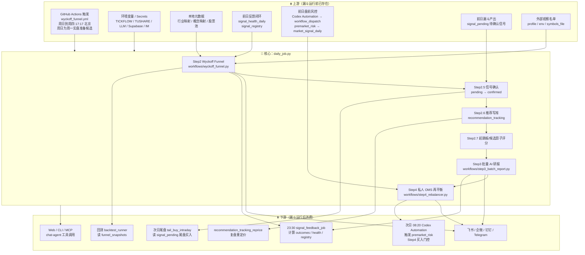
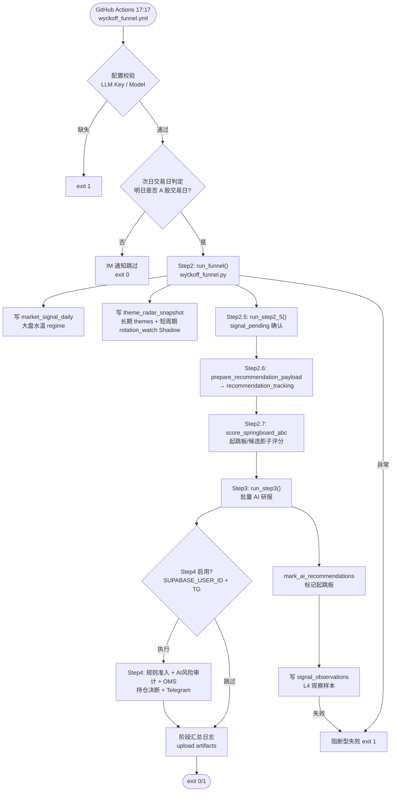
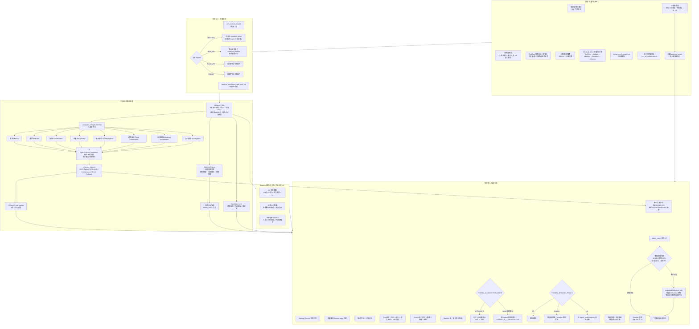
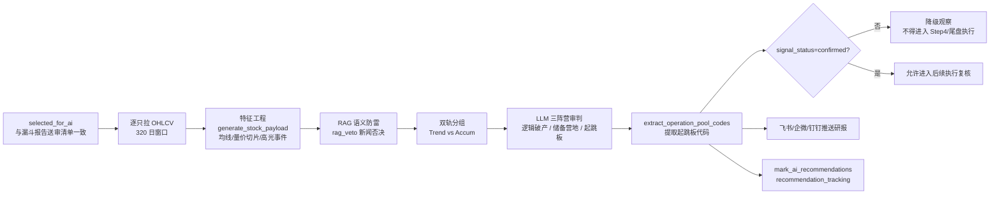
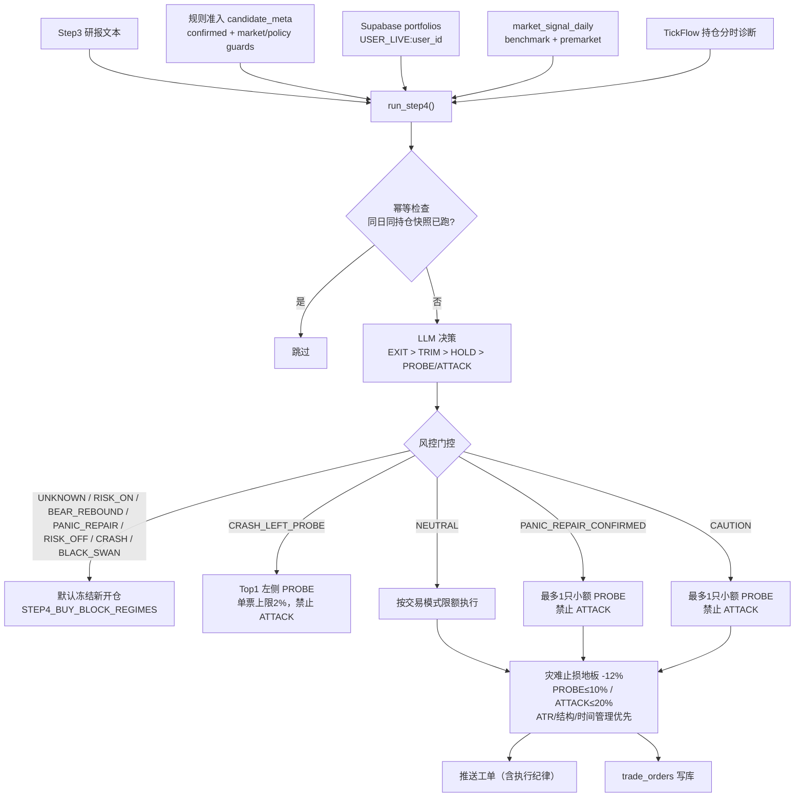
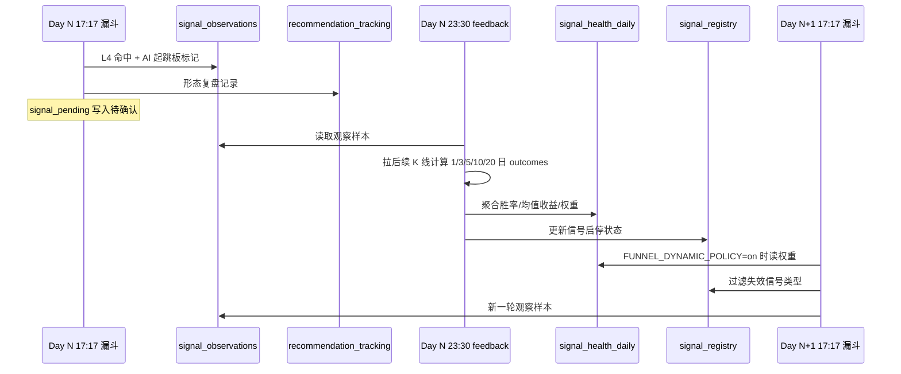
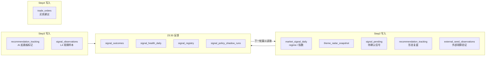

# A 股主漏斗执行流程

> 本文描述 A 股 Wyckoff 主漏斗从 GitHub Actions 触发到 Supabase 写库、跨日反馈闭环的完整执行链路。
> **实盘操作口径**见 [`OPERATOR_PLAYBOOK.md`](OPERATOR_PLAYBOOK.md)。策略逻辑见 [`../README_STRATEGY.md`](../README_STRATEGY.md)，架构见 [`ARCHITECTURE.md`](ARCHITECTURE.md)。

**主入口**：`.github/workflows/wyckoff_funnel.yml` → `scripts/daily_job.py`（周日到周四 **17:17** 北京时间；周日正常为周一实盘准备候选，仅在次日不是 A 股交易日时跳过）

---

## 一、系统全景：上下游关系



---

## 二、主入口：`daily_job.py` 完整执行链

**触发**：`.github/workflows/wyckoff_funnel.yml` → `python scripts/daily_job.py`



### 阶段与代码映射

| 阶段 | 入口 | 核心模块 |
|------|------|----------|
| 调度 | `wyckoff_funnel.yml` | GitHub Actions |
| 编排 | `scripts/daily_job.py` | 主流程 |
| Step2 | `workflows/wyckoff_funnel.py` | `core/wyckoff_engine.py` |
| Step3 | `workflows/step3_batch_report.py` | `tools/report_builder.py` |
| Step4 | `workflows/step4_rebalancer.py` | `core/holding_diagnostic.py` / `core/wyckoff_engine.py` |

---

## 三、Step2 漏斗内部：主线发现 + 多车道详细流程

**核心函数**：`run_funnel_job()` → `core/wyckoff_engine.py`



### 正式候选来源

| 来源 | 进入条件 | 是否可直接买 |
|------|----------|--------------|
| 传统 Wyckoff | L1/L2/L3 后出现 L4 信号 | 不直接买，先进入 AI/二次确认 |
| 主线候选 | `mainline_score` 达标，且 timing gate 过关 | 不直接买，仍需 AI/尾盘确认 |
| 候选车道 | 趋势回踩、平台突破、强承接等结构接近 | 默认观察，质量足够才按配额送审 |
| Shadow 旁路 | L2 未过但有复盘价值，或外部观察名单 | 不进入正式 AI，除非显式打开开关 |

报告将三类状态分开命名：Spring/LPS/SOS/EVR 命中称为“L4 量价触发”；A/B/C 只表示“起跳板结构”完整度；`pending/confirmed/expired` 才是跨交易日确认状态。三者不能互相替代，OMS 也不会生成 `confirmed`。

正式候选在送入 Step3 前还会经过 `core/candidate_policy.py` 的统一损失护栏。纯 SOS 必须通过 Springboard ABC 3/3；单 EVR、单 LPS 与单 Trend Pullback 默认仅观察。状态已是可交易的主线候选可跳过这三类“仅观察”限制，但仍必须通过最低分、市场环境、弱确认、过热和高位追涨检查；“主线观察”与“过热不追”不享受豁免。L2 的八通道原始命中数会写入诊断日志，但不参与评分。

### 数据质量与诊断口径

- 生产漏斗默认开启交易日新鲜度硬断路器：股票 OHLCV 至少 95% 必须对齐目标交易日，两个基准指数也必须对齐；否则任务直接失败并报警，不生成基于旧行情的报告。`FUNNEL_DATA_FRESHNESS_HARD_FAIL=0` 只用于显式研究/故障诊断。
- OHLCV 和市值覆盖率均不得低于 95%。每日量价漏斗不请求全市场财务指标，财务覆盖率显示为“未纳入量价漏斗”；仅显式启用质量/基本面筛选时，财务覆盖率不得低于 90%。Step3 仍为最终少量候选补充财务快照。
- 任一必需覆盖率不足，运行状态标记为 `degraded`，交易就绪度强制为 `observe_only`。候选仍可进入 AI/shadow 对照，但报告、结构化详情和候选行都会禁止正式推荐、写入执行清单或新开仓。
- 报告展示三个覆盖率、OHLCV 数据源数量与占比、RPS universe 数量，以及 L1 到 L4 的输入、通过、淘汰数量和该层筛选原因。
- 主题诊断把中长线 `themes` 与短周期 `rotation_watch` 分开：后者按 5/10/20 日相对动量、5 日上涨宽度和热度识别升温主题，只在报告中作为 Shadow 提示，不能改变 `selected_for_ai`、正式推荐、市场总闸或 OMS。
- 报告按“一眼结论 → 主线与轮动 → 候选 → 详细市场证据”排序，并把轮动发现与交易许可分行展示；视觉层级不参与策略计算。
- L2 保留多标签；没有通道命中时返回空标签，不再兜底伪装成“点火破局”。概念聚合按股票稳定去重，同一股票不会对同一概念重复计数。
- CLI/MCP 的 `get_market_overview` 支持 `trade_date` 历史截面；设置 `include_breadth=true` 后，同时返回该交易日全市上涨、下跌、平盘家数、涨跌占比和均值/中位数。指数涨跌与个股宽度必须使用同一交易日截面解释，不得用指数方向代替涨跌家数。
- 大盘先独立输出结构周期 BULL / TRANSITION / BEAR，再叠加中期宽度（站上 MA20 的股票占比）和当日宽度（上涨家数占比及涨跌幅中位数）。结构 BEAR 不再要求近 3 日继续大跌才判 RISK_OFF；短反弹仍禁止普通新仓，全市场广度达到风险偏好阈值时只进入 `BEAR_REBOUND` 观察。恐慌修复按三日状态机处理：恐慌日为 `CRASH`；恐慌次日只有在指数反弹且上涨家数占比不低于 60%、涨跌幅中位数为正时才进入 `PANIC_REPAIR` 修复候选，此时只复核、禁止新仓；再下一交易日指数收益不低于 0%、上涨家数占比不低于 50%且涨跌幅中位数不为负，才进入 `PANIC_REPAIR_CONFIRMED`。

### L4 触发信号

候选合并后，未确认 Alpha `launchpad` 在 CAUTION 只保留影子观察；其它可交易水温最多占一个候选席位，
避免固定类型优先级把 Spring/LPS/SOS、主线和其它确认结构全部挤出 TopN。

| 信号 | 含义 | 典型轨道 |
|------|------|----------|
| SOS | 放量突破 | Trend |
| Spring | 假跌破收回 | Accum |
| LPS | 缩量回踩 | Accum |
| EVR | 放量不跌 | Trend |
| Compression | 压缩蓄势 | 通用 |
| Trend Pullback | 趋势回踩 | Trend / Mainline |

`core/wyckoff_structure.py` 会在同一批 L3 股票上额外识别动态交易区间，并对 Spring、LPS、SOS、EVR
生成 `structure_shadow` 对照。该结果只记录区间覆盖率、正式/结构共同命中和各自独有命中，固定为
`observation_only`，不合并进正式 `triggers`，不参与候选评分、二次确认、回测成交或 OMS。
结构区间质量按测试次数、ATR 归一化宽度和漂移评分；结构诊断异常时只把 shadow 标记为 `unavailable`，
正式 L4 继续运行。正式 Spring 使用近期 swing low 中位支撑并在样本不足时回退最低收盘价；SOS 同时校验
均量倍数和历史量能分位。

### 外部观察名单

`external_seeds` 用于把人工关注、社区反馈或其它系统给出的股票加入同一套漏斗观察，而不是作为正式候选来源：

- 配置来源：`config/profiles/a_share_prod.yml`、`FUNNEL_EXTERNAL_SEED_SYMBOLS`、`FUNNEL_EXTRA_SYMBOLS` 或 `symbols_file`
- 默认只做 shadow 观察：记录是否通过 L1/L2、是否在 L2 后触发 L4、是否过期
- 外部观察名单固定为 shadow-only，不进入 `selected_for_ai`
- 通过 L4 的外部观察对象会额外写入 `signal_observations`，`selection_mode=external_seed_shadow`

---

## 四、Step3 AI 研报流程



**LLM 配置**（workflow 默认）：

- Step3：`STEP3_LLM_PROVIDER=gemini`，fallback `efficiency`
- 输入不是原始 K 线，而是压缩后的结构特征
- 漏斗展示的送审数量与 Step3 实际输入保持一致；模型审判不等于执行放行，`confirmed` 仍是 Step4/尾盘硬门槛
- 空候选仍发送空集报告、合规摘要和明日执行结论，并明确区分上游空输入、RAG 全剔除和数据门槛过滤；主 provider 失败时按配置回退，不会在 daily-job 包装层静默跳过

---

## 五、Step4 OMS 持仓决断

Step4 不再默认把“Step3 起跳板”当成唯一入口。生产默认 `STEP4_AI_CANDIDATE_POLICY=veto_only`：程序先收集全部跨日确认、市场与候选护栏均允许的新仓候选，再剔除 Step3 明确归入“逻辑破产”的代码。AI不能把未确认、只读、观察或市场阻断候选升级成买入；对外部新仓给出的 `ATTACK` 也会被降为 `PROBE`。

候选审计只保留两种模式：`veto_only` 应用 Step3 的明确否决，`shadow` 仅记录分类用于实验对照。两种模式都不绕过尾盘价格确认和 OMS。



### 回放与确认安全边界

- 显式设置 `END_CALENDAR_DAY` 即进入历史回放模式。Step2/Step3 可以按目标日重放，但任务会在读取实盘持仓、订单或 Step4 Supabase 状态前跳过 Step4，历史结果不会改写当前 OMS。
- Step4 新开仓确认采用字段级白名单：接受明确的 `confirmed` 状态、`signal_confirmed` 来源和受控确认标签；只要载荷含 `unconfirmed`、`pending`、`未确认`、`待确认` 或 `观察` 等否定状态，就先行拦截，不再用字符串包含关系推断确认。

### 报告执行纪律

日漏斗、Step3、尾盘、OMS 推送正文顶部固定附带 `core/execution_playbook.py` 的 **「🧭 执行纪律」**（闸门、主线优先、5 日持有、-12% 灾难地板）。操作解读见 [`OPERATOR_PLAYBOOK.md`](OPERATOR_PLAYBOOK.md)。

---

## 六、尾盘执行层（与日漏斗串联）

| 项 | 说明 |
|----|------|
| 入口 | `tail_buy_1440.yml` → `scripts/tail_buy_intraday_job.py` |
| 候选 | 读 `signal_pending`；**confirmed 才可 BUY** |
| 排序 | confirmed → 主线/趋势 → 信号分 |
| 主线语义 | `candidate_theme / candidate_phase / candidate_role` 从推荐、信号贯穿到尾盘记录；LLM 只解释不重判 |
| 禁新开 | `RISK_ON` 与弱市/修复期与 Step4 对齐，新票不买 |
| 双水温门控 | benchmark 与 premarket 分别判断；任一硬拦截即禁止所有新开仓，`UNKNOWN` fail-closed；`CAUTION` 只开放 PROBE |
| 持仓 | 硬止损约 12%；非主线满 5 日建议时间止盈 |
| 读法 | 只执行 **BUY（可执行）**；WATCH/SKIP 不下手 |

**日漏斗 = 候选池；尾盘 = 今天买不买。缺一不可。**

---

## 七、跨日反馈闭环

漏斗与 feedback 是**错峰运行**的反馈系统：漏斗先产出观察样本，feedback 盘后验收，下一轮漏斗再读取新的策略状态。详见 [`SIGNAL_FEEDBACK_LOOP.md`](SIGNAL_FEEDBACK_LOOP.md)。



本页只保留 feedback 在 A 股执行链中的先后关系。`FUNNEL_DYNAMIC_POLICY` 的三种模式、表字段、归因展示和
正式晋级条件统一见 [`SIGNAL_FEEDBACK_LOOP.md`](SIGNAL_FEEDBACK_LOOP.md)，不在流程图文档重复维护。

---

## 八、上下游相对顺序

盘前风险是 Step4 的上游门控；尾盘消费已确认候选；盘后漏斗产出下一交易日观察池；重定价与 feedback
在漏斗之后更新复盘数据；maintenance 最后清理滑动窗口。具体北京时间、cron 和完整工作流清单只在
[`ARCHITECTURE.md`](ARCHITECTURE.md#github-actions-主要工作流) 与 `.github/workflows/` 维护。

---

## 九、Supabase 数据流



---

## 十、数据源降级链（OHLCV）

```
TickFlow (优先, qfq 前复权)
  ↓ 失败
Tushare
  ↓ 失败
AkShare
  ↓ 失败
Baostock
  ↓ 失败
efinance
```

- 批量参数：`BATCH_SIZE=200`，`MAX_WORKERS=4`，320 交易日窗口
- 快照：`data/funnel_snapshots/`（供回测离线使用）

---

## 十一、当前生产配置要点

来源：`.github/workflows/wyckoff_funnel.yml`

| 变量 | 当前值 | 作用 |
|------|--------|------|
| `FUNNEL_AI_SELECTION_MODE` | `tradeable_l4` | 只把可交易 L4 结构送入 Step3，减少裸 SOS/EVR 追高噪声 |
| `FUNNEL_AI_TOTAL_CAP` | `8` | 质量达标候选的最终统一硬上限；主线、战略和主题补位共同竞争 |
| `FUNNEL_AI_MAX_PER_SECTOR` | `2` | 最终送审清单的单行业上限，避免同一板块占满上下文 |
| `FUNNEL_DYNAMIC_POLICY` | `shadow` | 主流程用静态配额，同时记录动态策略差异 |
| `FUNNEL_DAILY_BREADTH_REPAIR_PCT` / `FUNNEL_DAILY_BREADTH_WEAK_PCT` | `60` / `35` | 修复候选日上涨家数占比阈值 / 强结构转弱阈值 |
| `FUNNEL_PANIC_REPAIR_CONFIRM_MAIN_PCT` / `FUNNEL_PANIC_REPAIR_CONFIRM_BREADTH_PCT` | `0` / `50` | 修复候选次日的指数价格与上涨家数占比确认阈值 |
| `FUNNEL_AI_NEUTRAL_TREND` / `FUNNEL_AI_NEUTRAL_ACCUM` | `5` / `1` | 中性市主线/趋势主导，Accum 仅残量 |
| `FUNNEL_AI_RISK_ON_TREND` / `FUNNEL_AI_RISK_ON_ACCUM` | `5` / `1` | 过热市 AI/shadow 研究配额；正式推荐与新开仓由市场闸门禁止 |
| `FUNNEL_EXTERNAL_SEED_SYMBOLS` / `FUNNEL_EXTRA_SYMBOLS` | 空 | 临时追加外部观察名单；存在时自动启用 external seed shadow |
| `STEP4_BUY_HARD_STOP_PCT` | `12.0` | 新开仓灾难止损地板；ATR/结构/时间管理优先 |
| `STEP4_REPAIR_PROBE_BUDGET_LIMIT` | `0.05` | `PANIC_REPAIR_CONFIRMED` 单票试探仓上限；同时最多只开放一只 |
| `STEP4_LEFT_PROBE_BUDGET_LIMIT` | `0.02` | `CRASH_LEFT_PROBE` 单票左侧试探仓上限；同时最多只开放一只 |
| `STEP4_REQUIRE_CONFIRMED_BUY_CANDIDATE` | `1` | Step4 新开仓只允许显式跨日确认候选；否定/观察状态优先拦截，不做模糊字符串匹配 |
| `STEP4_AI_CANDIDATE_POLICY` | `veto_only` | `veto_only` 只剔除逻辑破产；`shadow` 仅记录分类用于实验对照 |
| `TAIL_BUY_CONFIRMED_ONLY_BUY` | `1` | 尾盘买入只对二次确认候选输出 BUY |
| `TAIL_BUY_AI_POLICY` | `veto_only` | AI 只能降级或否决规则结论，不能把 `WATCH` 升为 `BUY`；`shadow` 只记录 |
| `TAIL_BUY_LEFT_PROBE_CLOSE_POS_MIN` / `TAIL_BUY_LEFT_PROBE_SPRING_QUALITY_MIN` | `0.65` / `50` | CRASH 左侧例外要求的最低收位与分钟线 Spring 质量；仍需跌破支撑后收回 |
| `TAIL_BUY_HOLDING_HARD_STOP_PCT` | `12` | 持仓尾盘诊断的固定止损兜底；ATR 放宽需显式开启且受上限约束 |
| `STEP4_BUY_BLOCK_REGIMES` | `UNKNOWN,RISK_ON,BEAR_REBOUND,PANIC_REPAIR,RISK_OFF,CRASH,BLACK_SWAN` | 市场数据未就绪、过热与弱市均冻结新开仓 |

---

## 相关文档

| 文档 | 内容 |
|------|------|
| [`OPERATOR_PLAYBOOK.md`](OPERATOR_PLAYBOOK.md) | **实盘怎么用**：日漏斗 × 尾盘串联纪律 |
| [`README_STRATEGY.md`](../README_STRATEGY.md) | 策略逻辑、L1–L5、配额、尾盘与 OMS |
| [`ARCHITECTURE.md`](ARCHITECTURE.md) | 架构、Actions 全表、Supabase 表结构 |
| [`SIGNAL_FEEDBACK_LOOP.md`](SIGNAL_FEEDBACK_LOOP.md) | 信号反馈闭环详解 |
| [`GLOSSARY.md`](../GLOSSARY.md) | 术语速查 |
