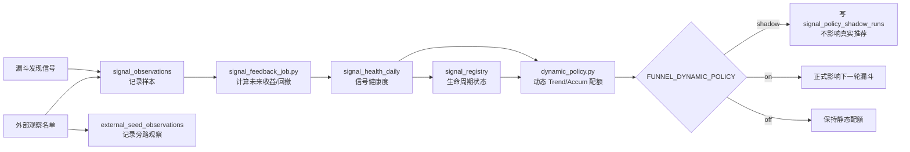
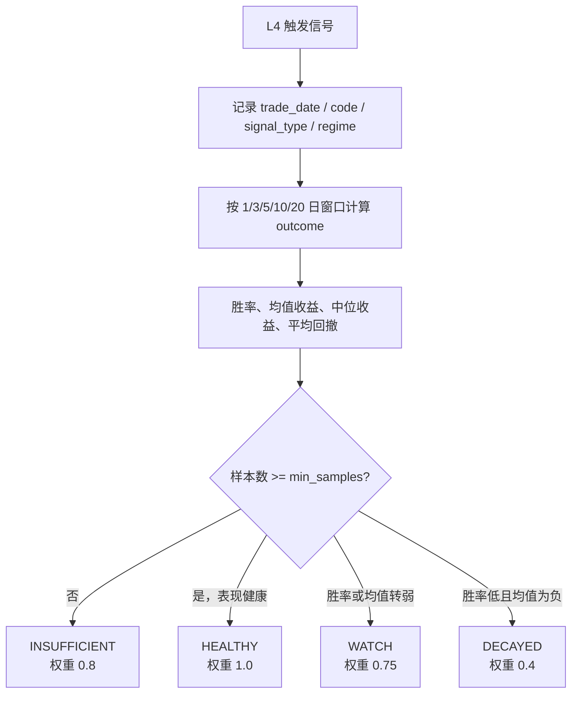
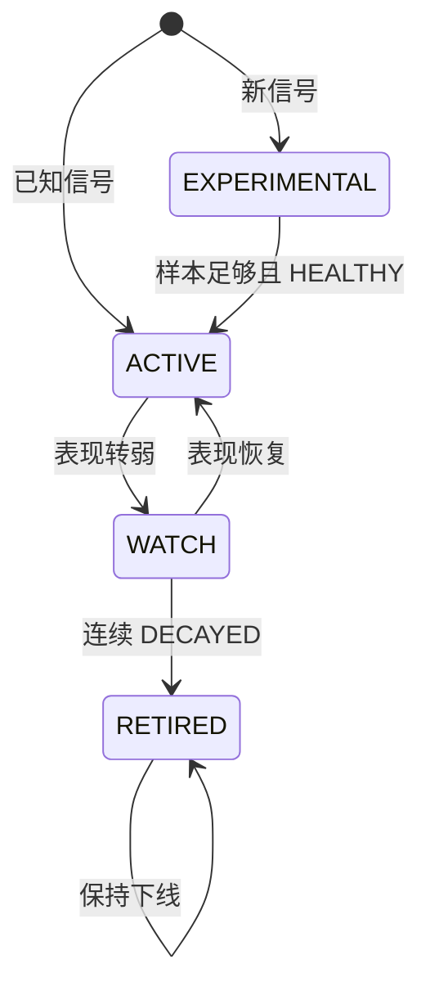
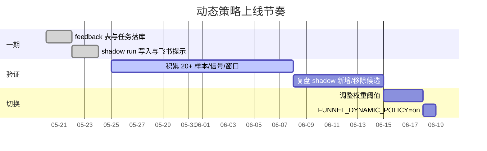

# Wyckoff 系统迭代策略

> 当前阶段：**一期已落地，建议先 shadow 验证**。
> 目标不是让模型“每天换脑袋”，而是让系统长期知道哪些信号正在变强、变弱、该观察还是该退役。

## 总览



## 实现状态

| 方向 | 目标 | 当前实现 | 状态 |
|------|------|----------|------|
| 方向一：信号衰减监控 | 追踪 SOS / Spring / LPS / EVR / Compression 的后续表现 | `signal_observations` 记录样本和 price-action footprint，`signal_outcomes` 计算收益 / 回撤，`signal_health_daily` 聚合健康度 | 已落地一期 |
| 方向二：多策略动态分配 | AI 候选配额从静态规则变为数据驱动 | `dynamic_policy.py` 根据信号权重调整 Trend / Accum 配额，支持 `off` / `shadow` / `on` | 已落地框架，待 shadow 复盘 |
| 方向三：信号生命周期管理 | 新信号孵化、正式上线、观察、退役 | `signal_registry` 维护 `ACTIVE` / `WATCH` / `EXPERIMENTAL` / `RETIRED` | 已落地骨架，阈值待样本校准 |
| 方向四：外部观察验证 | 验证人工/社区/其它系统关注的股票是否真有结构优势 | `external_seed_observations` 记录 L1/L2/L4 位置，L4 确认样本补写 `signal_observations` | 已落地 shadow 观察 |
| 方向五：候选影子评分 | 验证“好候选”是否能被更稳定地识别 | `features_json.candidate_shadow_score` 合成漏斗优先级、量价痕迹、起跳板、尾盘确认、外部资金和风险扣分 | 已落地 shadow 特征，待 outcome 校准 |
| 方向五补充：入场质量归因 | 验证相近候选中“更好的入场位置”是否更容易跑赢 | `features_json.entry_quality` 记录 Step3 入场质量评分，归因页按 S/A/B/C/D 展示后续表现 | 已落地 observation + Web 归因展示，待样本校准 |
| 方向六：短线冲刺事件评估 | 验证推荐股未来 5 个交易日内是否触及 +10% | `evaluate_recommendation_events.py` 生成严格 5 日标签、Top-K 排序对照，并按 candidate shadow / entry quality 档位切片和排序对照，后台任务支持 `recommendation_event_eval` | 已落地只读评估，待持久化标签 |

完整执行链路见 [`SIGNAL_FEEDBACK_LOOP.md`](SIGNAL_FEEDBACK_LOOP.md)。

## Agent Harness 边界

CLI agent 默认让模型负责错别字、同义表达、上下文恢复和任务拆分；harness 只保留工具边界、写入确认、并发、持久化、超时和循环保护。基于固定短语强制某个工具的旧式 turn expectation 已降级为显式严格模式：只有设置 `WYCKOFF_STRICT_TOOL_EXPECTATIONS=1` 或测试显式开启时才会强制重试。

direct runtime、dynamic workflow runtime 和 workflow planner 使用同一条语义契约：能合理推断的表述偏差、口语省略或术语混用，先按最高置信假设执行，并在最终回答里说明假设；只有关键对象仍不可判定，或涉及写入、交易、高风险确认时才向用户提问。

runtime router 的输出仍提示模型使用标准 `direct` / `dynamic_workflow` JSON，但解析器会容忍中文别名、`workflow` 别名和百分比置信度。这里的宽松只作用于模型路由结果，不重新按用户原话做关键词分类，避免“用户聊天自然、代码格式很死”的体验。

当模型 router 不可用或输出无效时，harness 只保留一个窄兜底：明显要求“完整选股/候选股/好股票/股票池”并同时要求候选理由、攻防、研报、复核或买卖计划的聊天轮次，会进入 `dynamic_task`；“选出/挑出/筛出好股票”这类明确交付型短句也会进入 `dynamic_task`，防止自然聊天里的核心选股请求退化成单轮直答。普通持仓、单股诊断、概念解释和“怎么选出好股票”这类方法询问仍保持 direct。

workflow planner 支持模型在每个 task 上输出 `rationale`、`success_criteria` 和 `risk_guard`。这些字段会随 `WorkflowStep` 持久化、进入 sub-agent 执行上下文，并在 workflow 详情中展示，避免把动态 workflow 退化成只有标题和工具名的硬编码步骤列表。

CLI/TUI 的 workflow 计划事件会在模型生成的 step 带有 `rationale`、`success_criteria` 或 `risk_guard` 时，直接预览前几步的目标、验收标准和风险边界；没有这些元数据的旧计划仍保持紧凑。用户在聊天里批准前就能看到模型为什么这样拆、每步做到什么算完成、哪些动作不能越界。

workflow planner 允许模型自己拆分任务，但会把模型生成的脚本限制在 24 个 task 内；超过上限时，持久化脚本会记录 `step_limit`、`original_step_count` 和 `truncated_step_count`，CLI/TUI 的 workflow 计划行也会直接显示收敛后的任务数和被收敛数量。这样保留动态 workflow 的语义生成权，同时避免坏计划把 CLI/TUI、workflow 存储和最终 synthesis 拖成不可用。

workflow executor 会在每个 step 完成后短暂等待本 step 启动的后台任务，并提取压缩版工具 handoff（例如 `last_screen_result`、`last_recommendation_event_eval`、`last_ai_report`），放入 step result 和最终 synthesis prompt。这样“选出好股票”这类多阶段任务不会只依赖 sub-agent 文本转述或后台 `task_id`，最终汇总仍能看到候选代码、行动状态、质量分/评级和下一跳边界。

workflow 最终 synthesis 明确要求在存在候选或 `policy_selection` 时输出候选分层、关键质量分/评级、风险因素和下一步；遇到 `new_buy_allowed=false`、`trade_readiness=research_only` 或非可执行 `action_status` 时，不得写成买入建议，只能给观察、研报复核或攻防决策下一步。

最终 synthesis prompt 会把压缩后的候选 handoff 作为 `priority candidate handoff` 单独提前注入，并按 handoff 类型保留最新值；后续 `agent results` 只保留 step 文本、状态和 handoff 引用，不再重复塞同一批候选证据。`last_strategy_decision` 的 `candidate_guard_summary` 会随 priority handoff 和 fallback 摘要保留。即使 sub-agent 输出很长或最终 synthesis 模型空响应，候选代码、评分、评级、禁止直接买入原因和行动边界仍优先可见。

CLI/TUI 的工具结果摘要会把候选行动状态、优先分/动态分/漏斗分、候选影子评级/分和入场质量评级/分直接显示在候选行里；`screen_stocks` 会把同一批质量字段从 `symbols_for_report` 传播到 `top_candidates`、`selection_brief`、`decision_brief` 和 `action_plan`，并在筛选阶段直接生成 `candidate_guard_summary`，确保摘要去重后首选候选仍保留质量证据和禁止直接买入边界，便于后续模型回合继续引用。`evaluate_recommendation_events` 会把最新 policy picks 也转成同一套 `candidate_guard_summary`，让只读排序评估出来的“重点候选”天然带上标签成熟度和观察/复核边界。`generate_ai_report` 会复用同一套 `candidate_guard_summary`，在研报完成但候选仍有未成熟标签、观察池或阻断状态时，把下一跳限定为组合攻防复核，而不是让 `next_tool` 看起来像无条件买入计划。

Step4 攻防决策的候选 payload 会在 `[候选归因]` 中保留候选影子评级/分、入场质量评级/分、排序策略、AI 推荐状态、标签成熟度、风险因素和下一步，避免最终组合决策只看到代码和价格、看不到“为什么能复核/为什么不能直接买”。`generate_strategy_decision` 的工具结果和 CLI/TUI 摘要会同步输出 `candidate_guard_summary`，把候选标签未成熟、观察池、数据质量阻断、市场闸门阻断或确认不足的候选标成“禁止直接买入”；即使模型误给出 PROBE / ATTACK，系统层也会转成 `NO_TRADE`，且这类系统拒单不占用组合新买名额。

如果最终 synthesis 模型空响应或异常，workflow fallback 会使用真实 step results，并从 `handoff_state` 恢复候选 brief、推荐评估、AI 研报 handoff 和攻防决策 handoff；多阶段 handoff 同时存在时，会先保留每个阶段的关键行再补充候选细节。即使最后一跳 LLM 没产出，用户也能看到已完成步骤、候选代码、证据分、研报状态、攻防下一步，而不是空泛的完成提示。

## 方向一：信号衰减监控

**目标**：按信号类型追踪推荐质量，识别正在失效的信号。



当前口径：
- 按 `signal_type + regime + horizon_days` 聚合，同时生成 `ALL` regime 汇总。
- 默认 registry 判断使用 10 日窗口。
- 样本不足时不贸然退役，只降低权重或保持实验态。
- `features_json.price_action_footprint` 记录承接、缩量、突破质量、派发压力和失败突破标签，用于把“主力痕迹”从主观描述变成可回测特征。
- `features_json.intraday_tail_confirmation` 记录正式候选的尾盘 1m VWAP、尾段量能、聪明钱和尾盘确认分，用于验证日线候选是否被尾盘分钟线确认；当前只做复盘特征，不参与候选排序。
- `features_json.source_context` 记录龙虎榜、融资融券、大宗交易和可选逐笔大单等外部资金佐证；当前只做解释和复盘特征，不参与候选排序。
- `features_json.candidate_shadow_score` 记录候选影子评分，把上述证据汇总成 0-100 分和 S/A/B/C/D 评级；当前只做复盘特征，不参与候选排序。
- `features_json.entry_quality` 记录 Step3 入场质量评分，把相对强弱、缩量、200 日线偏离和成交额转为 S/A/B/C/D；当前只做复盘特征，Step3 仅在 `STEP3_ENTRY_QUALITY_TIE_BUCKET` 控制的相近优先级候选中用作 tie-breaker，默认 1 分桶，避免未校准质量分压过明显更高的上游优先级。

## 方向二：多策略动态分配

**目标**：让 AI 候选配额随信号表现变化，而不是永远固定 Trend / Accum 比例。

当前动态权重来源：

| 来源 | 作用 |
|------|------|
| `signal_health_daily.weight_multiplier` | 信号胜率和收益变差时降低权重。 |
| `signal_registry.status` | `EXPERIMENTAL` / `RETIRED` 信号不参与动态候选。 |
| 市场广度 `breadth.delta_pct` | 广度改善时略偏 Trend，广度走弱时略偏 Accum。 |

运行模式：

| 模式 | 行为 | 用途 |
|------|------|------|
| `off` | 完全使用静态配额 | 默认安全模式 |
| `shadow` | 真实推荐不变，额外记录动态策略会选什么 | 上线前观察 |
| `on` | 动态策略正式影响候选分配 | shadow 稳定后的正式模式 |

Shadow 复盘重点看 `signal_policy_shadow_runs`：
- `diff_added`：动态策略新增的候选。
- `diff_removed`：动态策略移除的静态候选。
- `signal_weights`：触发这次差异的信号权重。
- `registry_snapshot` / `health_snapshot`：当时策略状态快照。

外部观察复盘重点看 `external_seed_observations`：
- `watch_status`：观察对象是被 L1 拒绝、已过 L2、L4 确认，还是只适合继续观察。
- `l4_trigger_tags`：外部观察名单是否真的出现 Spring / SOS / LPS / EVR / Compression。
- `expires_at`：观察有效期，过期后由 maintenance 清理。

## 方向六：短线冲刺事件评估

**目标**：把“未来 5 个交易日内触及 +10%”从主观期望变成可重复的离线评估口径，同时用胜率、平均收盘收益、盈亏比、MFE/MAE 和下行尾部约束过拟合。

当前已落地只读评估：
- `scripts/evaluate_recommendation_events.py`：读取 `recommendation_tracking`，拉 TickFlow 日 K，输出 `summary.json` / `events.json` / `summary.md`。
- `core.recommendation_event_metrics.build_horizon_event()`：严格排除推荐日当天，只看推荐日之后未来 N 个交易日。
- `workflows.web_background_job` 支持 `job_kind=recommendation_event_eval`，可由 GitHub Actions 或 Web 后台任务触发。
- `evaluate_recommendation_events` 已作为 CLI agent 后台工具暴露，用户只在聊天里要求验证近期推荐/筛出重点候选时，模型可以直接读取 `ranking_decision` 和最新 `policy_selection`；完成后会写入候选 handoff，后续 `generate_ai_report` / `generate_strategy_decision` 可自然复用最新 policy picks。
- CLI TUI 的后台完成回调会立即恢复候选 handoff，用户看到完成提示后可直接说“就用这个生成研报/做决策”，不必显式调用任务状态查询。
- 评估结果仅写 artifact，不写回 `recommendation_tracking`，避免在公开推荐页里增加难解释的短线事件列。
- 评估会只读 join 同日 `signal_observations.features_json`，在 summary 中输出 `candidate_shadow_grade` 和 `entry_quality_grade` 分组，用同一套 5 日 hit/MFE/MAE 口径验证候选质量档位。
- `summary.top_k_by_strategy` 额外比较 `candidate_shadow_then_score` 和 `entry_quality_then_score`，用于观察“按质量分排序的 Top-K”是否优于原 `score_only`，但不改变真实推荐排序。
- `summary.top_k_lift_vs_score_only` 会直接输出各排序策略相对原 `score_only` 的 hit rate、收盘收益、MFE、MAE 和赔率差值，减少人工对表误差。
- `summary.ranking_decision` 把 Top-K lift 转成保守上线门槛：样本量、命中率 lift、MFE lift 和 MAE 恶化都过线时才把某个排序策略标为 `candidate`；否则保持 `score_only`，避免凭单次表格手动改生产排序。
- `policy_selection` 根据 `ranking_decision` 对最新推荐日输出一组只读候选：未过门槛时仍按 `score_only`，过门槛时展示 promoted ranking 选出的 Top-K；同时提供 policy 级 `action_plan`（`new_buy_allowed=false`、`trade_readiness=research_only`、下一跳工具）和 pick 级 `action_status` / `quality_factors` / `risk_factors` / `next_step`，供 agent / dashboard 快速复盘，不直接改生产推荐。

当前 5 日 +10% 评估结果（最新 30 个推荐日，2026-06-28 本地实测）：

| 口径 | 成熟样本 | 命中率 | 平均 MFE | 平均 MAE |
|------|----------|--------|----------|----------|
| 全量推荐 | 740/743 | 29.05% | 8.21% | -8.51% |
| AI 标记 | 146/149 | 22.60% | 7.24% | -7.91% |
| 漏斗分 Top1 | 26/28 | 38.46% | 11.27% | -7.81% |
| 漏斗分 Top3 | 78/81 | 42.31% | 10.35% | -8.52% |
| 漏斗分 Top5 | 130/133 | 40.00% | 9.76% | -8.52% |

阶段性结论：
- 目标应定义为“每日 Top-K 冲刺事件命中率”，不是“推荐表每只股票都 5 日涨 10%”。
- 漏斗分排序已经有有效 lift；默认候选排序应优先看 `funnel_score`，AI 标记更适合作为 Top1 辅助校验、解释和风险提示，不应直接作为 Top3/Top5 主排序轴。
- 当前最大短板是回撤：命中率有基础，但平均 5 日 MAE 仍接近 -8%，需要后续引入尾盘确认、失败突破和市场状态过滤。
- 产品层应把“冲刺池 Top1/Top3”和“观察池”分开展示；允许弱市/崩盘日没有新推荐，避免为了填满推荐表稀释信号。

反过拟合约束：
- 5 日 +10% 命中率只能作为事件标签之一，不能作为唯一调参目标。
- 推荐质量至少同时看 `close_win_rate_pct`、`avg_close_return_horizon_pct`、`close_payoff_ratio`、`mfe_mae_ratio` 和 `mae_le_neg5_rate_pct`。
- 参数变更必须跨不同市场状态复测：强势、震荡、退潮、崩盘日都要覆盖，不能只根据最近 5 个或 30 个推荐日调阈值。
- 合格方向是“涨的个数更多、平均收益为正、赔率覆盖亏损、尾部回撤受控”，不是追求每一只都涨或每次都触达 +10%。

如果线上表已经执行过早期的事件标签扩展，可用以下 SQL 清理：

```sql
drop index if exists public.idx_recommendation_tracking_hit_10_5d;

alter table public.recommendation_tracking
  drop column if exists hit_10_5d,
  drop column if exists label_5d_ready,
  drop column if exists mfe_5d_pct,
  drop column if exists mae_5d_pct,
  drop column if exists close_return_5d_pct,
  drop column if exists first_hit_10_5d_date,
  drop column if exists days_to_hit_10_5d,
  drop column if exists event_label_updated_at;
```

只读评估：

```bash
.venv/bin/python scripts/evaluate_recommendation_events.py \
  --market cn --horizon-days 5 --target-pct 10 --max-dates 30
```

## 方向三：信号生命周期管理

**目标**：形成“研究 → 实验 → 正式 → 观察 → 退役”的闭环。



当前实现是保守版：
- 已知信号样本不足时保持 `ACTIVE`，避免冷启动阶段误杀。
- 未知信号样本不足时进入 `EXPERIMENTAL`。
- `WATCH` 后再次 `DECAYED` 才退到 `RETIRED`。

## 上线节奏



建议顺序：
1. 先把 `FUNNEL_DYNAMIC_POLICY` 设为 `shadow`。
2. 连续观察 `signal_policy_shadow_runs`，确认动态策略不是只在追噪声。
3. 用后续收益验证 `diff_added` 是否优于 `diff_removed`。
4. 再切 `on`，并保留回滚到 `shadow` / `off` 的路径。

## 运营检查点

| 看什么 | 表 / 位置 |
|--------|-----------|
| 漏斗本轮记录了多少信号样本 | `signal_observations` |
| outcomes 是否跑完 | `signal_outcomes.status` |
| 哪些信号正在变弱 | `signal_health_daily.health_state` |
| 哪些信号被降级或退役 | `signal_registry.status` |
| shadow 会改变哪些候选 | `signal_policy_shadow_runs.diff_added` / `diff_removed` |
| 飞书是否提示 shadow 写入 | A 股漏斗推送卡片的“动态策略 Shadow”行 |

## 剩余风险

- 当天刚写入的 observation 通常缺少未来 K 线，短周期 outcome 可能先是 `pending`。
- 早期样本少，权重更像“提醒灯”，不适合直接当作强交易信号。
- 不同 regime 下样本会被进一步切薄，`ALL` 汇总和具体 regime 都要看。
- Shadow 优于静态不是看“选得不一样”，而是看 `diff_added` 的后续收益是否长期好于 `diff_removed`。

## Wyckoff 系统的天然优势

Wyckoff 体系属于衰减较慢的一侧：
- 中长期持仓（日线级别），不是毫秒级套利。
- 多因子复合系统：量价结构、阶段、板块、regime 共同确认。
- 自研事件库：Spring / SOS / LPS / EVR / Compression 的识别口径不是公开单因子。

最大风险不是单一信号衰减，而是整套形态识别被更多人复现。动态反馈闭环的意义，就是让系统持续知道哪些信号仍然值得信，哪些信号需要降权、观察或退役。
