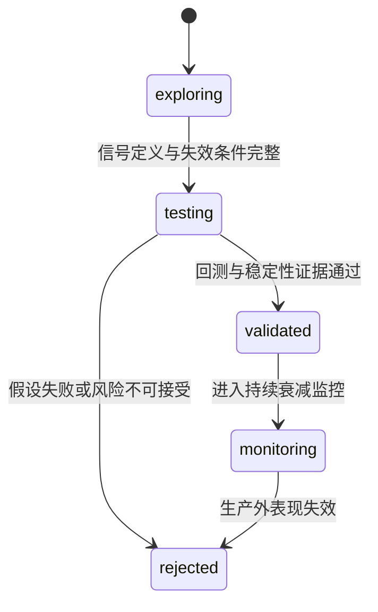

# Wyckoff 系统迭代与研究治理

> 本页只回答“下一步研究什么、证据达到什么标准才能晋级”。反馈表、动态策略字段和 Shadow 查询口径统一见
> [`SIGNAL_FEEDBACK_LOOP.md`](SIGNAL_FEEDBACK_LOOP.md)；Agent Runtime 的实现边界统一见
> [`ARCHITECTURE.md`](ARCHITECTURE.md#agent-架构)。

## 当前阶段

系统已经具备信号 outcome、健康度、生命周期、候选影子评分、入场质量和动态策略 Shadow。当前重点不是继续
增加规则，而是积累跨市场状态样本，证明新增信息能稳定提高收益/回撤比，并拒绝只在单一窗口有效的参数。

| 研究方向 | 已有观测面 | 当前决策 |
|----------|------------|----------|
| 信号衰减 | SOS / Spring / LPS / EVR / Compression 的 outcomes 与 health | 继续积累多周期、分 regime 样本 |
| 动态分配 | 静态与动态候选的 `diff_added` / `diff_removed` | 保持 Shadow，未获正式晋级许可 |
| 信号生命周期 | `ACTIVE / WATCH / EXPERIMENTAL / RETIRED` | 保守处理冷启动，阈值待样本校准 |
| 外部观察 | L1/L2/L4 位置与后续 outcome | 仅作旁路验证，不晋级正式候选 |
| 候选影子评分 | S/A/B/C/D 档位与后续收益、回撤 | 仅作归因，不直接改排序 |
| 入场质量 | 相近上游优先级内的质量档位 | 仅允许窄 tie-breaker，继续验证 |
| 短线事件 | 未来 5 日命中、MFE、MAE 与 Top-K lift | 只读评估，不回写生产推荐 |
| 主题轮动 | `rotation_watch` 的短周期动量和宽度 | Shadow 提示，不改变主线确认或 OMS |
| 基本面质量 Overlay | 公告日前可见财报的 point-in-time 历史回放 | 0/3 周期通过，保留研究脚本，不接入 Shadow/生产 |
| A股实证入场 | confirmed 信号族、市场广度与跨触发器排序 | 默认回测 A/F/G/H/I，未验证前不改变生产漏斗 |

### 基本面质量 Overlay 本地结论（2026-07-18）

本轮用固定随机种子的 300 只当前在市股票，在 2020 暴跌、2021 牛段、2022 熊段、2024 小盘弱势、
2025 反弹和 2026 近期六个窗口回放 884 笔交易。财报只允许使用 `announce_date < signal_date` 的记录，
测试动作固定为“剔除 `grade=weak`，未知样本保留”，持有期为 5/10/20 交易日。

- 三个持有期均未达到预注册晋级门槛；平均收益分别变化 -0.049pp、-0.335pp、-0.451pp。
- P10 分别恶化 -0.706pp、-0.536pp、-0.728pp，大亏率分别增加 1.269pp、1.113pp、3.633pp。
- 每个持有期都只有 3/6 窗口改善，未达到 60% 的跨窗口一致性门槛。
- `weak` 档 212 笔的均收为 -1.518%，反而好于 `strong` 的 -1.793% 和 `neutral` 的 -3.528%，
  说明这套通用质量阈值不能当作 Wyckoff 短中期信号的否决器。

结论为 `keep_research_only`：不改 confirmed、市场闸门、候选排序、Step3 或 OMS。回放仍有当前在市股票池的
幸存者偏差，且供应商历史财务可能含修订回填；这些限制只会降低晋级可信度，不构成放宽门槛的理由。

## 研究对象与证据台账

每个策略增量先登记为研究假设，而不是直接变成生产开关：

`research_hypothesis` 记录 thesis、信号定义和失效条件；`research_evidence` 用稳定 `artifact_ref` 关联
`backtest`、`stability`、`attribution`、`shadow`、`report` 或 `observation`。状态只能通过
`research_transition` 合法迁移，普通字段更新不能绕过审计改变 status。

## 晋级证据门槛

`testing → validated` 至少需要最近的 `backtest=pass` 和 `stability=pass`，但这仍不等于生产交易许可。
晋级评审按以下顺序检查：

1. **处理暴露真实存在**：规则必须实际改变 `(signal_date, code)` 交易集合；零暴露只能记为 `no_effect`。
2. **跨周期有效**：近期、牛市、熊市都要覆盖，不能用单段行情代替稳健性。
3. **参数不孤立**：锚点附近至少有两个可比较邻居，且稳定邻居比例达到门槛。
4. **样本外不失效**：训练窗口选出的持有/退出参数在后续窗口原样测试，测试期不得重新选参。
5. **收益与风险同时改善**：不只看命中率，还看现金收益、最大回撤、MFE/MAE、赔率和尾部亏损。
6. **Shadow 贡献可解释**：`diff_added` 应持续优于 `diff_removed`，且不是由单一信号、单一行情或少数右尾交易驱动。
7. **人工复核通过**：数据口径、前视偏差、执行成本和回滚路径均明确后，才讨论生产开关。

Backtest Grid 输出跨周期确认、`parameter_stability.json` 和 `walk_forward_validation.json`。当前
walk-forward 只验证持有期与退出参数；SOS、Spring、LPS 等触发阈值必须进入专项矩阵后，才能声称完成
触发器样本外验证。经典形态 B/C/D/E 在 2026-07-18 的三周期消融中未达到晋级要求：B 无真实暴露，
C/E 降低近期与牛市收益，D 没有经济改善。因此默认算力不再重复运行 B-E，只保留手动复验能力。

新的默认消融固定为 `A/F/G/H/I`：A 是生产口径基线；F 剔除 EVR confirmed；G 同时剔除 EVR 与
SOS confirmed；H 只在 NEUTRAL 同时满足 MA20 广度、广度增量和当日上涨家数确认时允许新入场；I 不再
直接跨信号比较原始 Wyckoff 分数，而以历史 confirmed 命中率先验和封顶后的形态强度重排。F-I 都是
回测研究策略，不会因单次胜出自动改写生产漏斗、Step3 或 OMS。

`pending_mode=only` 的报告必须把成交触发器显示为实际 confirmed 信号族；同一股票当日还命中更高分的
未确认形态时，可以保留更高数值供归因，但不能把标签降级成裸 `spring` / `sos`。`both` 研究模式仍按
更强来源展示，避免把合流实验误报为 confirmed-only。

## Shadow 到生产的边界

`FUNNEL_DYNAMIC_POLICY=shadow` 只记录动态候选差异。切到 `on` 前必须同时满足：

- `policy_governor` 不再要求补样本或回测；
- `promotion_checklist` 的样本、差异表现、scoped 调权和回测确认均通过；
- `formal_dynamic_allowed=true`；
- 人工确认最新报告来源、freshness、作用范围和回滚方式。

`manual_review_required` 只表示可以开始人工评审，不能解释为自动批准。信号级调权、主题轮动、候选影子分
和 AI 结论都不能单独打开市场总闸或越过 OMS。

## 研究优先级

| 优先级 | 工作 | 完成定义 |
|--------|------|----------|
| P0 | 修复数据泄漏、标签污染、候选与回测口径不一致 | 同一输入在实盘与回放得到同一候选语义 |
| P1 | 扩充跨周期与参数邻域证据 | 弱周期、稳定性、walk-forward 均有明确结论 |
| P1 | 验证现有 Shadow 特征 | 多个窗口降低回撤或提高风险调整后收益 |
| P2 | 研究新的形态、主题或外部数据 | 先进入 observation/shadow，不影响正式候选 |
| P3 | 展示和解释优化 | 不改变任何计算、晋级或交易权限 |

## 反过拟合纪律

- 不因最近一次回测或单个榜单调整生产阈值。
- 不把 GitHub Actions 成功、AI 高置信度或高命中率单独当作策略通过。
- 不用当前截面行业、概念、财务或幸存股票池伪装 point-in-time 安全结果。
- 不同时改多个变量后归因到其中一个规则。
- 不用复利曲线、少数大赚交易或未经成本约束的收益掩盖弱周期亏损。
- 允许研究结论为 `rejected`；删除无效复杂度也是有效迭代。

## 运营复盘

日常复盘只看四层：

1. 数据是否完整、新鲜、可复现；
2. 信号与 Shadow 是否有足够成熟 outcome；
3. 跨周期、稳定性和样本外证据是否一致；
4. 当前结论是继续观察、拒绝、人工评审，还是已获正式许可。

具体表、字段、Agent/Web 展示口径和排查顺序由
[`SIGNAL_FEEDBACK_LOOP.md`](SIGNAL_FEEDBACK_LOOP.md) 统一维护，避免在路线图里复制实现细节。
