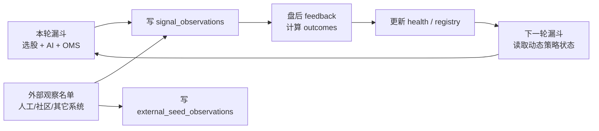
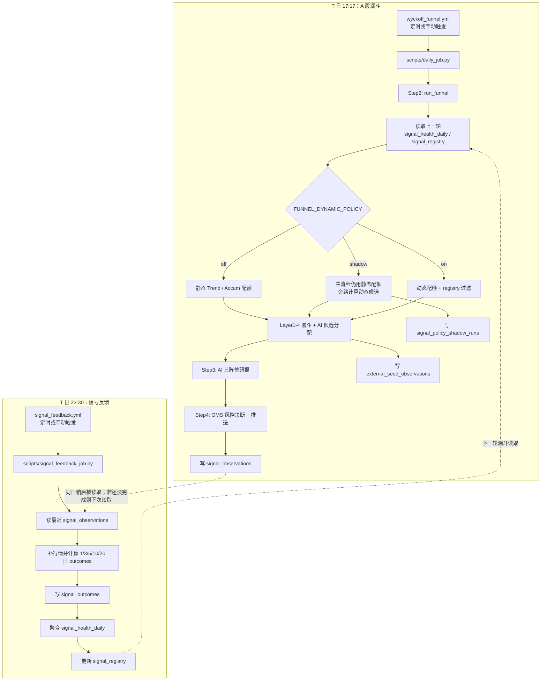
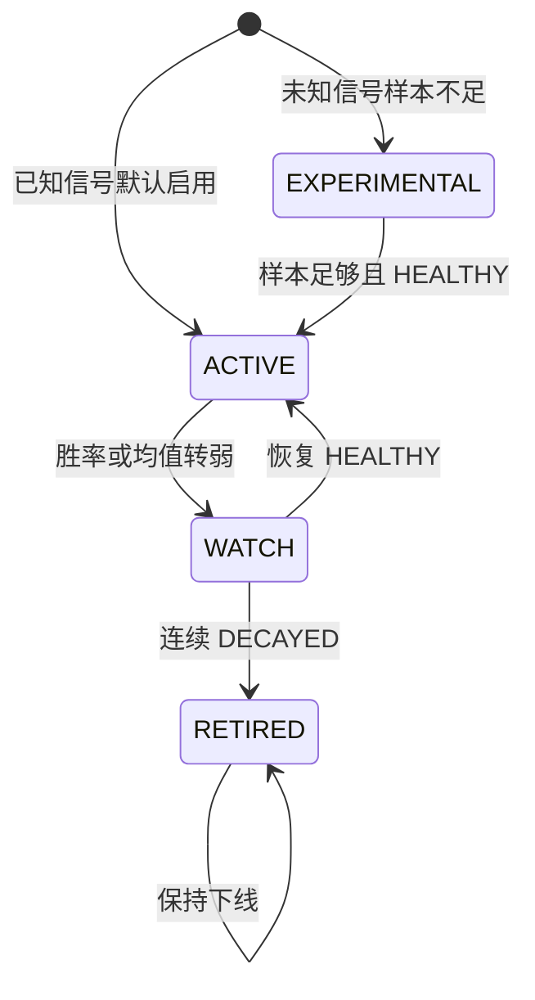
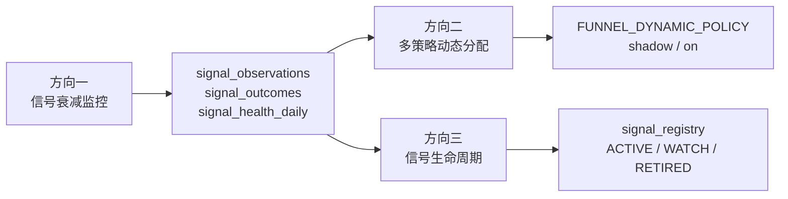

# 信号反馈与动态策略闭环

[← 返回架构文档](ARCHITECTURE.md)

这份文档说明 A 股定时漏斗、信号反馈任务、动态配额和 shadow run 的真实执行关系。它也可以作为 GitHub Wiki 的技术架构页素材。

## 一句话

漏斗负责**发现机会并生产信号样本**，feedback 负责**盘后验收信号表现并更新策略状态**，动态策略在**下一轮漏斗**读取这些状态。外部观察名单只进入同一套观察闭环，不作为正式候选来源。默认不是强同步链路，而是错峰运行的反馈闭环。



## 定时流程



## 顺序语义

| 场景 | 结果 |
|------|------|
| 漏斗先完成，feedback 后完成 | 当前推荐路径。feedback 处理本轮写出的 observations，更新下一轮可用的 health / registry。 |
| feedback 先完成，漏斗后完成 | 漏斗会读取已经存在的最新策略状态；漏斗新写的 observations 等下一次 feedback 处理。 |
| 两个任务因手动触发发生重叠 | 不会互相等待，也不会破坏数据；feedback 只处理当时已经落库的 observations，漏掉的样本下一轮补上。 |
| 需要强制串行 | 可以改成 `workflow_run` 或把 feedback 作为漏斗 workflow 的后置 job，但会牺牲独立性。 |

## 动态策略模式

`FUNNEL_DYNAMIC_POLICY` 控制动态策略是否介入漏斗。

| 模式 | 主流程候选 | 额外落库 | 适用阶段 |
|------|------------|----------|----------|
| `off` | 静态配额 | 无 | 默认保守模式 |
| `shadow` | 静态配额 | `signal_policy_shadow_runs` 记录动态配额会选哪些、会换掉哪些 | 观察新策略是否稳定，不影响漏斗正式输出 |
| `on` | 动态配额 + registry 过滤 + 策略归因调权 | observations / outcomes 正常记录 | shadow 结果稳定后切正式 |

GitHub Actions 中建议用 Repository Variables 配置：

| 配置项 | 推荐值 | 说明 |
|--------|--------|------|
| `FUNNEL_DYNAMIC_POLICY` | `shadow` | 非敏感配置，优先放 GitHub Variables；也兼容 Secrets。 |
| `FUNNEL_EXTERNAL_SEED_SYMBOLS` / `FUNNEL_EXTRA_SYMBOLS` | 空 | 临时追加外部观察名单；存在时自动启用 external seed shadow。 |
| `WYCKOFF_WRITE_CONTEXT` | `server_job` | 只有 Actions / server job 可写共享信号、推荐、策略表；CLI 默认只读云端。 |
| `WYCKOFF_STRATEGY_REFLECTION` | `shadow` | 开启策略反思 shadow 写入，不自动晋级生产策略。 |
| `SUPABASE_SERVICE_ROLE_KEY` | service role key | 定时任务写反馈表需要绕过 RLS。 |

本地临时验证：

```bash
FUNNEL_DYNAMIC_POLICY=shadow uv run python scripts/daily_job.py
uv run python scripts/signal_feedback_job.py
```

## 核心数据表

| 表 | 写入方 | 读取方 | 作用 |
|----|--------|--------|------|
| `signal_observations` | 漏斗 `daily_job.py` | feedback job | 记录某日某股票触发了什么 L4 信号，是否进入 AI，是否被 AI 推荐，以及当日 price-action footprint。 |
| `signal_outcomes` | feedback job | feedback job | 记录每个 observation 在 1/3/5/10/20 日后的收益、回撤和完成状态。 |
| `signal_health_daily` | feedback job | 漏斗 | 按 signal / regime / horizon 聚合胜率、平均收益、样本数和权重。 |
| `signal_registry` | feedback job | 漏斗 | 管理信号生命周期：`ACTIVE`、`WATCH`、`EXPERIMENTAL`、`RETIRED`。 |
| `signal_policy_shadow_runs` | 漏斗 shadow 模式 | 人工复盘 | 比较静态策略和动态策略的候选差异。 |
| `external_seed_observations` | 漏斗 | 人工复盘 / maintenance | 记录外部观察名单是否通过 L1/L2/L4、watch 状态和过期时间。 |
| `strategy_reflections` | strategy reflection job | 人工复盘 | 保存基于 outcomes / shadow 的策略反思快照。 |
| `strategy_policy_candidates` | strategy reflection job | 人工复盘 | 保存 `READY_FOR_REVIEW` 候选策略，不自动切生产。 |

## 外部观察 Shadow

`external_seed_observations` 解决的是“我额外关注的股票，为什么没被漏斗选中”的复盘问题。它记录外部观察名单在当天主漏斗里的真实位置：

- `REJECTED_L1`：基础流动性、ST、财务或股票池过滤未通过。
- `PASSED_L2`：已经进入八通道强度主路径。
- `L4_CONFIRMED`：没进 L2，但在外部观察旁路里出现 L4 触发。
- `WATCH`：通过 L1 但暂时没有 L2/L4 结构。

主线引擎不复用 `external_seed_observations.watch_status` 表示状态；它通过 `candidate_lane=mainline`、`candidate_status=主线买点候选/主线观察/过热不追` 和 `mainline_score` 等字段进入推荐与信号元数据。

当外部观察名单触发 L4 且没有进入正式候选时，系统会补写 `signal_observations`，`source=external_seed:<source>`，`selection_mode=external_seed_shadow`。这部分只用于后续 outcome 复盘，不影响真实推荐和 AI 候选池。

## L2 旁路 Shadow

L2 旁路和战略 L2 旁路解决的是“L2 没过，但形态或主线线索值得继续观察”的问题。它们不同于 `mainline` 正式候选：主线候选必须通过独立 timing gate，旁路默认只做 shadow。近期 shadow 归因显示，直接把 L2 旁路送入正式 AI 推荐会显著放大亏损，因此默认只记录样本，不再晋级 AI 候选：

- `source=l2_bypass_shadow` / `selection_mode=l2_bypass_shadow`：普通 L2 拒绝但 L4 有形态的观察样本。
- `source=strategic_l2_bypass_shadow` / `selection_mode=strategic_l2_bypass_shadow`：主题线索或 60m 救援结构触发的战略观察样本。
- `source=mainline` / `selection_mode=mainline`：主线引擎输出的正式候选，只有 `主线买点候选` 才允许进入 AI 候选池。
- 只有显式打开 `FUNNEL_L2_BYPASS_AI_ENABLED=1` 或 `FUNNEL_STRATEGIC_L2_BYPASS_AI_ENABLED=1` 时，旁路才允许进入 AI 输入；生产默认关闭。

这部分样本继续写入 `signal_observations` 和后续 `signal_outcomes`，用于验证“哪些 L2 外的 A 股波动结构真的有价值”。在样本不足或收益为负时，不应把旁路改成正式买入入口；真正可买的主线票应走 `mainline_score + timing_score + AI/尾盘确认` 链路。

## 信号生命周期



registry 只负责控制动态策略是否使用信号；原始 observations 仍会记录，避免因为下线后失去后续观测能力。

## Price-Action Footprint

`signal_observations.features_json.price_action_footprint` 记录每个信号日的量价痕迹，用于后续回答“哪一种主力行为痕迹有效”，不作为新的候选来源：

- `absorption_score`：放量但收盘不弱、支撑收回、下影承接等吸收迹象。
- `dry_up_score`：缩量回踩、波动收窄，验证卖压是否枯竭。
- `breakout_quality_score`：突破位、量能、收盘位置和上影压力。
- `supply_pressure_score`：放量弱收、长上影、潜在派发压力。
- `failed_breakout_score`：盘中突破后收不住，标记失败突破风险。
- `reclaim_score`：跌破支撑后快速收回的 Spring / reclaim 质量。

这些字段和 `springboard_*` 一起落库，后续由 `signal_outcomes` 验证，而不是直接把外部或人工名单推入 AI 候选池。

## Intraday Tail Confirmation

`signal_observations.features_json.intraday_tail_confirmation` 记录正式主漏斗候选的尾盘 1m 分钟线确认特征。它复用 tail-buy 链路里的 VWAP、尾段量能、尾盘聪明钱和尾盘规则评分，用来复盘“日线候选在收盘前是否被分钟线确认”：

- `tail_score` / `tail_decision`：按尾盘规则得到的 BUY / WATCH / SKIP 观察标签。
- `dist_vwap_pct`：尾盘最新价相对当日 VWAP 的距离。
- `tail30_volume_share`：最后 30 根 1m 的成交量占比。
- `smart_money_score`：尾盘量价方向相对早盘的强弱。
- `last30_ret_pct` / `last15_ret_pct`：尾段价格动量。

这部分只写入 `features_json` 做 outcome 复盘，不改变主漏斗候选、AI 候选池、loss guard 或 Step4。

## External Capital Context

`signal_observations.features_json.source_context` 记录正式主漏斗候选的外部资金佐证。当前通过 AkShare 按需读取龙虎榜、融资融券和大宗交易；逐笔大单使用腾讯分笔源作为可选项，默认不打开，避免日常任务被慢速网页源拖住：

- `lhb`：东方财富龙虎榜详情，记录上榜原因、净买额、买入额和卖出额。
- `margin`：上交所 / 深交所融资融券明细，记录融资余额、融资买入、融资偿还和融券变化。
- `block_trade`：东方财富大宗交易每日明细，记录成交笔数、成交额、折溢率和主要买卖席位。
- `tick_large_order`：腾讯分笔数据汇总的大额成交，仅在 `FUNNEL_EXTERNAL_CAPITAL_TICK_CONTEXT=1` 时启用。
- `source_status`：每个外部源的成功、失败或降级状态，便于复盘时区分“没有资金痕迹”和“源失败”。

这部分只作为外部资金痕迹解释和 outcome 复盘特征，不改变主漏斗候选、AI 候选池、loss guard 或 Step4。

## Candidate Shadow Score

`signal_observations.features_json.candidate_shadow_score` 记录候选影子评分。它把主漏斗优先级、量价痕迹、起跳板质量、尾盘确认、外部资金佐证和风险扣分合成 0-100 分，用来复盘“哪些候选更像真机会”：

- `score` / `grade`：总分和 S/A/B/C/D 评级。
- `components.funnel`：主漏斗触发分、候选车道优先级或主线评分。
- `components.price_action`：承接、缩量、突破质量和支撑收回等量价痕迹加分。
- `components.springboard`：起跳板/二次确认质量加分，历史 ABC 仅作为内部特征，不再要求报告按 A+B+C 呈现。
- `components.tail_confirmation`：尾盘 VWAP、尾盘规则评分和 BUY/WATCH 确认加分。
- `components.external_capital`：龙虎榜净买、融资买入、大宗交易和大单净买等资金佐证加分。
- `components.risk_penalty`：派发压力、失败突破、弱收盘、尾盘跌破 VWAP 等扣分。
- `positive_tags` / `negative_tags`：可解释的正负证据标签。

这部分只做 shadow 复盘，不新增候选表，也不改变正式候选、AI 候选池或 Step4。只有当后续 `signal_outcomes` 证明它能提高胜率或降低回撤时，才考虑把总分升成结构化列或用于真实排序。

`strategy_attribution_report.py` 会把 `candidate_shadow_score.grade` 聚合进 `score_bucket_stats_json._candidate_shadow_grade`，Web 端策略归因页展示 S/A/B/C/D 各档在不同持有周期下的胜率、平均收益、大涨率、大跌率和平均回撤。`evaluate_recommendation_events.py` 也会只读 join 同日 observation，把候选影子分档输出到 `summary.candidate_shadow_grade`，并在 `summary.top_k_by_strategy.candidate_shadow_then_score` 对照“按候选影子分排序”的 5 日冲刺命中率、MFE 和 MAE；`summary.top_k_lift_vs_score_only.candidate_shadow_then_score` 会直接给出相对原漏斗分排序的差值，`summary.ranking_decision` 进一步用样本量、命中率 lift、MFE lift 和 MAE 恶化门槛判断它是否只是观察项，还是可以进入下一步排序接入候选。

## Entry Quality

`signal_observations.features_json.entry_quality` 记录 Step3 候选的入场质量评分。它聚合相对强弱、缩量回踩、200 日线偏离和 20 日平均成交额，用于验证“同样进入候选池时，哪些入场位置更值得优先看”：

- `score` / `grade`：0-100 分和 S/A/B/C/D 评级。
- `tag`：进入 Step3 prompt 的中文摘要，例如 `入场质量A(75.0)`。
- `risk_flags`：弱于指数、缩量不足、追高延展、成交额偏低等风险标签。
- `priority_bucket`：按候选优先级粗分桶，用于在相近 priority 下观察入场质量差异。

这部分只写入 `features_json` 做 outcome 复盘，不新增候选表，不直接改变正式候选、AI 候选池或 Step4。当前 Step3 只在相近优先级候选之间把入场质量作为 tie-breaker；默认 `STEP3_ENTRY_QUALITY_TIE_BUCKET=1.0`，即上游优先级落在同一 1 分桶内才允许入场质量改变先后顺序，设为 `0` 可禁用排序影响。后续是否提高权重，需要看 `signal_outcomes` 和归因快照。

`strategy_attribution_report.py` 会把 `entry_quality.grade` 聚合进 `score_bucket_stats_json._entry_quality_grade`，Web 端策略归因页展示 S/A/B/C/D 各档在不同持有周期下的胜率、平均收益、大涨率、大跌率和平均回撤；涨跌幅样本行也会显示当时的入场质量和风险标签。`evaluate_recommendation_events.py` 的 `summary.entry_quality_grade` 用同一套 5 日冲刺事件口径检查不同入场档位是否真的降低回撤或提高命中，`summary.top_k_by_strategy.entry_quality_then_score` 则对照“按入场质量排序”的 Top-K 表现；`summary.top_k_lift_vs_score_only.entry_quality_then_score` 会直接给出相对原漏斗分排序的差值。

## Shadow 复盘怎么看

Shadow 模式不会影响真实推荐。它的价值是回答三个问题：

1. 动态策略比静态策略多选了哪些股票？
2. 动态策略会移除哪些原本会进 AI 的股票？
3. `diff_added` 的后续收益/回撤是否长期好于 `diff_removed`？
4. 这些差异背后的 `signal_weights`、`attribution_signal_weights` 和 `registry_snapshot` 是否合理？

常用查询：

```sql
select
  trade_date,
  regime,
  base_policy,
  shadow_policy,
  diff_added,
  diff_removed,
  signal_weights,
  attribution_signal_weights
from signal_policy_shadow_runs
order by trade_date desc
limit 10;
```

`strategy_attribution_report.py` 会把 shadow 差异和已有 `signal_outcomes` 关联到
`shadow_diff_stats_json.outcome_stats`。只有当 `diff_added` 在多个周期的收益/回撤稳定好于
`diff_removed`，并且 missing outcome 不高时，才考虑把 `FUNNEL_DYNAMIC_POLICY` 从 `shadow`
切到 `on`。

归因报告里的信号级 `downweight` / `upweight` 已经是策略治理输入：尾盘策略会读取最新
`strategy_attribution_reports` 或本地只读报告文件进行候选调权；漏斗动态策略会把这些归因权重和
`signal_health_daily` / `signal_registry` 合并。`shadow` 模式下它只影响 shadow 对照候选，`on`
模式下才会影响漏斗正式候选。

Agent 入口也读取同一份执行态，避免页面、CLI 和 Web 各说一套。CLI 使用
`query_history(source="attribution")`，Web 读盘室使用 `query_attribution`；回答策略归因问题时先看
数据来源。CLI/MCP 会返回 `latest_source` 和 `remote_error`，Web 只读取远端
`strategy_attribution_reports`。随后必须看 `latest_execution_state` 和 `latest_operations`：
前者说明调权当前影响尾盘、漏斗 shadow 还是正式漏斗，后者给出最新 shadow 新增/移除样本和
scoped 调权明细，用于每日运营复盘。

生产归因任务默认使用最近 60 天窗口。漏斗和尾盘读取归因调权时会检查 `report_date`，默认只接受
7 天内的报告；可以通过 `STRATEGY_ATTRIBUTION_MAX_AGE_DAYS` 调整，设为 `0` 表示关闭过期保护。
远端报告过期时会回退本地 `STRATEGY_ATTRIBUTION_REPORT_JSON` / `TAIL_BUY_ATTRIBUTION_REPORT_JSON`
或 `/private/tmp/wyckoff-strategy-attribution/latest/report.json`，本地也过期则不调权。

### 策略治理器

`strategy_attribution_report.py` 还会生成 `shadow_diff_stats_json.policy_governor`，把
shadow 差异和信号表现收敛成统一的治理结论：

- `status`：`candidate` 表示 dynamic policy 可以进入人工晋级评审；`watch` 表示继续观察；
  `reject` 表示 shadow 新增组没有跑赢移除组；`insufficient_sample` 表示样本不足。
- `mode_recommendation`：只给出 `review_promote_dynamic_policy`、`keep_shadow` 或
  `keep_static_policy`，不自动修改生产配置。
- `promotion_status`：把生产晋级状态说清楚。`manual_review_required` 表示 shadow 已过主要量化门槛，
  但仍要人工检查多期报告和回测；`do_not_promote` 表示当前不应切 `on`；`collect_more_samples`
  表示样本不足；`keep_shadow` 表示继续观察。
- `promotion_checklist`：固定检查 shadow 样本量、shadow 新增组表现、scoped 信号调权、回测确认。
  这不是展示文案，而是 Agent/Web 判断“能不能切 dynamic=on”的证据结构。
- `signal_actions`：把信号表现转成 `downweight` / `upweight` / `hold`，并附带 count、平均收益、
  胜率、大亏率和平均回撤。

第一版治理器永远输出 `auto_apply=false`。它表示系统不会自动把 `FUNNEL_DYNAMIC_POLICY` 从
`shadow` 晋级到 `on`；不表示归因权重完全不参与策略。信号级调权可以进入尾盘和动态策略输入，
但模式晋级必须人工确认多期报告和回测一致。

## 和迭代策略的对应关系



当前一期已经覆盖方向一、方向二的 shadow/on 框架，以及方向三的 registry 骨架。后续主要工作是积累样本、复盘 shadow 差异，并把阈值从经验值迭代成回测验证后的参数。
