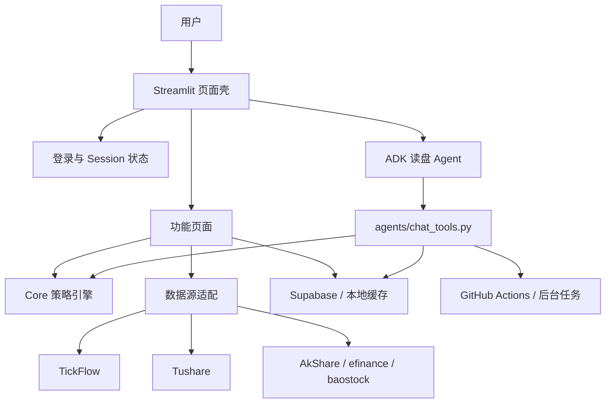
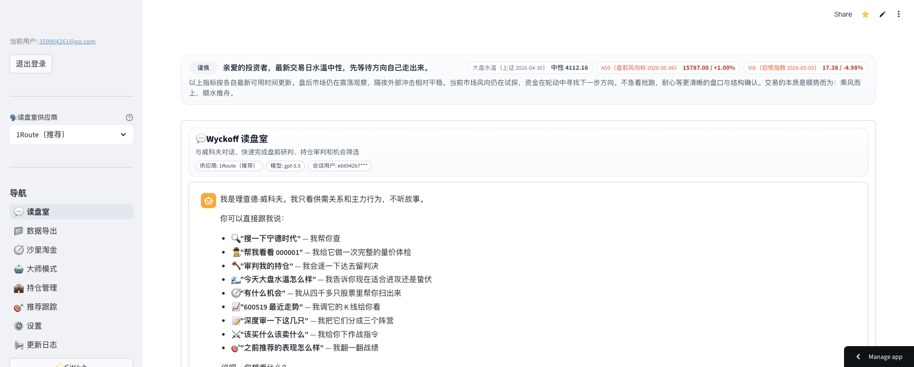
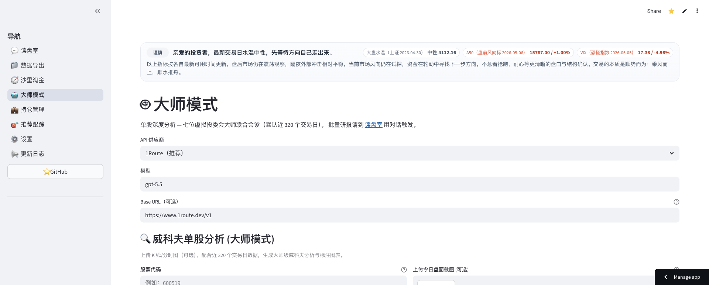
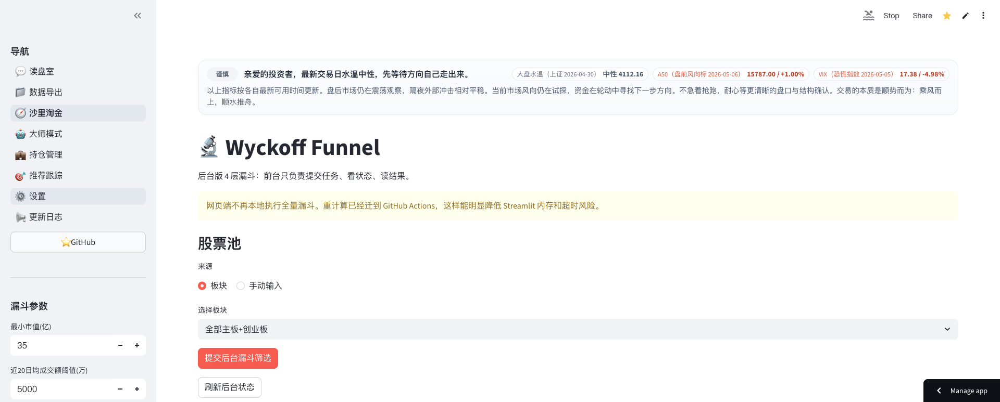
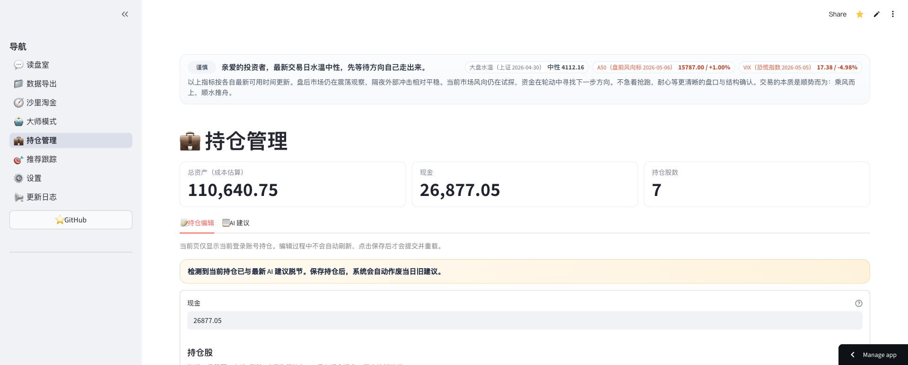
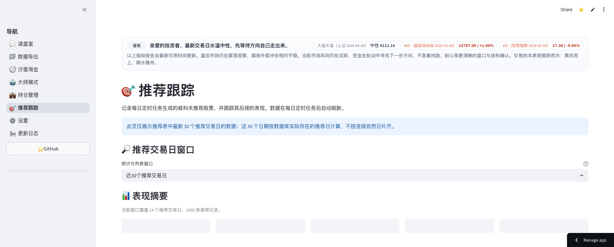
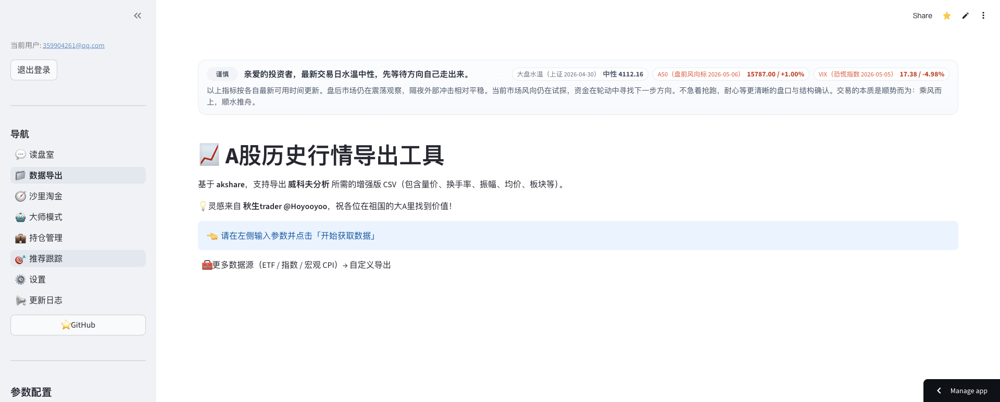
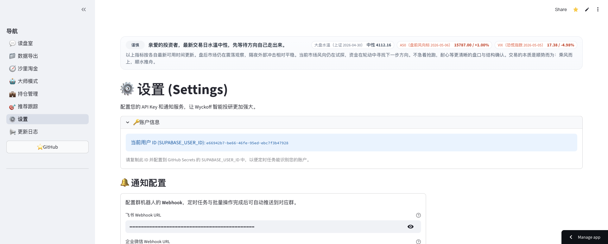

# Streamlit MVP 产品架构归档

[← 返回 README](../README.md)

> 状态：Streamlit 已经不再迭代维护，`main` 分支已全面移除 Streamlit 运行代码、依赖和 CI 路径。历史代码仍保留在 `release/streamlit` 分支。

本文是 Streamlit MVP 时期的产品架构与效果图归档，用于回看早期产品验证、页面组织和功能边界。后续新能力默认进入 CF Pages 读盘室、CLI、MCP 或 GitHub Actions，不再回流到 Streamlit。

## 产品定位

Streamlit MVP 的目标是快速验证“读盘室 + 单股诊断 + 选股复盘 + 持仓管理 + 数据导出”的闭环。它把投研工作流拆成若干独立页面，用最短路径把策略引擎、Supabase 数据、模型调用和人工配置串起来。

| 模块 | MVP 页面/代码 | 作用 | 当前替代入口 |
|---|---|---|---|
| 读盘室 | `streamlit_app.py` | 多轮问答、工具调用、即时诊断 | CF Pages `/chat`、CLI `wyckoff` |
| 大师模式 | `pages/AIAnalysis.py` | 单股 K 线 + 模型诊断 | CF Pages `/analysis`、CLI `wyckoff report` |
| 沙里淘金 | `pages/WyckoffScreeners.py` | 漏斗选股、候选池查看 | CF Pages `/chat`、CLI `wyckoff screen` |
| 持仓管理 | `pages/Portfolio.py` | 持仓录入、收益查看、诊断 | CF Pages `/portfolio`、CLI `wyckoff portfolio` |
| 形态复盘 | `pages/RecommendationTracking.py` | 推荐记录、后续涨跌跟踪 | CF Pages `/tracking`、CLI `wyckoff recommend` |
| 尾盘记录 | `pages/TailBuyHistory.py` | 尾盘策略执行历史 | CF Pages `/tail-buy`、Dashboard |
| 数据导出 | `pages/Export.py`、`pages/CustomExport.py` | 历史行情 CSV、批量导出 | CF Pages `/export` 保留单票导出；批量导出下线 |
| 设置 | `pages/Settings.py` | API Key、数据源、通知配置 | CF Pages `/settings`、CLI `wyckoff config` |

## 运行架构

MVP 架构的关键取舍：

- `app/` 负责页面布局、导航、登录组件和后台任务入口。
- `pages/` 负责每个 Streamlit 页面，页面内直接编排数据读取、表格展示和操作按钮。
- `agents/wyckoff_chat_agent.py` 与 `agents/session_manager.py` 曾承载 Google ADK 对话运行时。
- `agents/chat_tools.py` 是值得保留的资产，已经继续服务 CF Pages、CLI 和 MCP。
- `integrations/supabase_client.py`、`core/token_storage.py` 等模块曾服务页面会话与用户配置，主分支下线后不再保留。

## 下线原因

Streamlit 适合快速验证，但在当前产品阶段，它带来的状态同步、页面组件定制、部署隔离、会话可观测性和多端复用成本已经高于收益。项目主力入口已经迁移到：

- CF Pages：在线读盘室、单股分析、持仓、复盘、尾盘、设置。
- CLI：完整 AgentRuntime、多轮上下文、工具编排、Dashboard、记忆和诊断包。
- MCP：给 Claude Code 等本地 Agent 暴露结构化工具。
- GitHub Actions：定时任务、日报、尾盘策略、回放和质量检查。

## 效果图

### 读盘室

### 大师模式

### 沙里淘金

### 持仓管理

### 形态复盘

### 数据导出

### 设置

